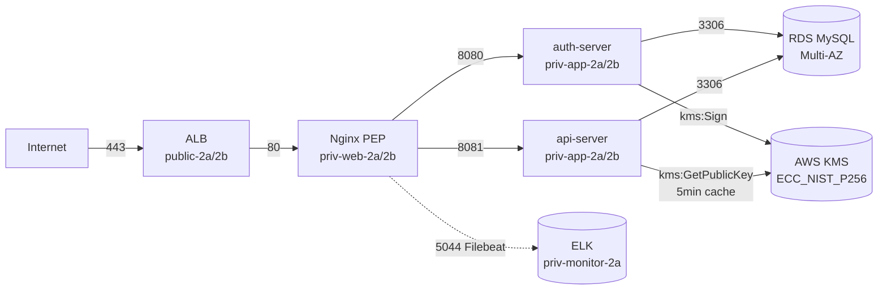
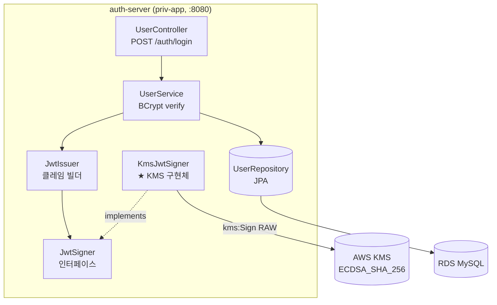
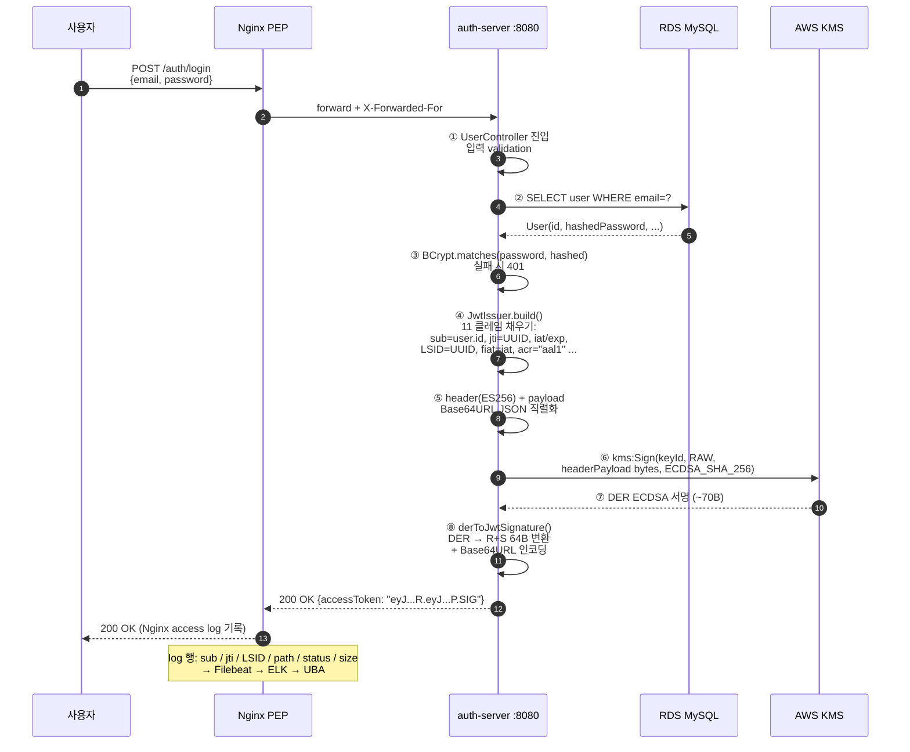
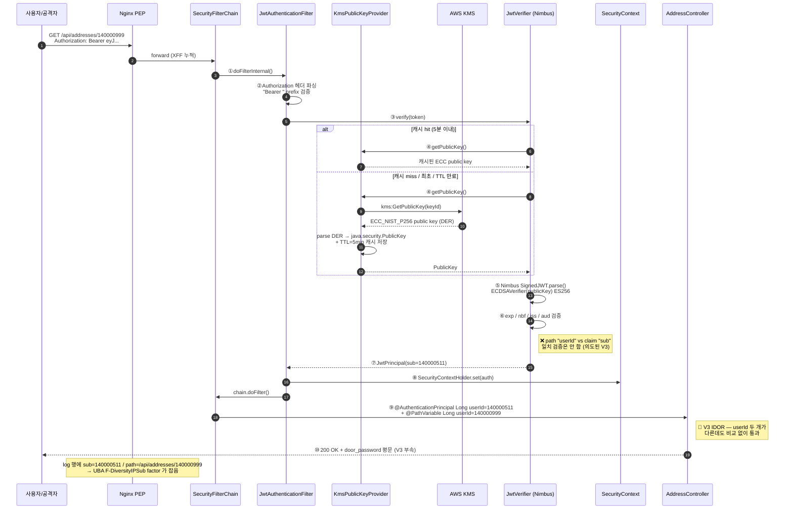

# 🛡️ ZETI Backend — Auth Server + API Server

> **ZETI (Zero Trust + UBA) — 아주대 캡스톤 / Google × Ajou AI Capstone Design**
> 2025년 쿠팡 JWT 키 유출 사고 재현 + UBA 기반 탐지 PoC 의 **백엔드 본체**

[](#)
[](#)
[](#)
[](#)

---

## ⚡ 30초 요약

본 레포는 **인증 (auth-server) + 자원 (api-server)** 두 개의 Spring Boot 서비스로 구성된 ZETI 백엔드 본체입니다. 쿠팡 사고 재현을 위해 **JWT 서명키를 AWS KMS (ES256, ECC_NIST_P256 비대칭)** 로 분리하고, 동시에 **IDOR · door_password 평문 노출 · MOCK OTP** 등 4종의 의도된 취약점을 시연 자산으로 유지합니다.

- 🔑 **AWS KMS ES256 서명**: auth-server 는 `kms:Sign` 만, api-server 는 `kms:GetPublicKey` 만 — 키 분리 원칙
- 🪪 **JWT 11 클레임 풀 페이로드**: `sub / jti / ext.LSID / acr / amr / fiat …` — 쿠팡 실 페이로드 리버스 그대로
- 🚨 **의도된 4 취약점**: IDOR (`/addresses/{userId}` · `/orders/{userId}` · `/users/{userId}`) + MOCK OTP `"123456"` — UBA 탐지 검증용
- 🏗️ **AWS Multi-AZ**: 단일 VPC · priv-app 2a/2b · RDS MySQL Multi-AZ · ALB → Nginx PEP → App
- 🧪 **시연 스크립트 자동화**: `scripts/all.sh` 1줄로 signup → login → 정상 → IDOR → 위조토큰 전체 흐름 검증

> ⚠️ **본 레포에는 의도된 보안 취약점이 존재합니다.** Codex/리뷰어가 이를 지적해도 "쿠팡 사고 재현용 시연 자산"이라 무시합니다. 임의로 "보안 강화" 패치를 적용하지 마세요.

---

## 🎬 Live Demo — 시연 흐름 (8 step)

```bash
cd backend/scripts
./all.sh        # 01_signup → 02_login → 03_self → 04_idor → 05_idor_modify → 06_negative → 07_forged_token
```

| Step | 스크립트 | 시연 메시지 | 기대 결과 |
|------|---------|------------|----------|
| 1 | `01_signup.sh` | 신규 사용자 가입 | 200 OK (이미 가입은 PASS, 멱등) |
| 2 | `02_login.sh` | ES256 JWT 발급 | 토큰 추출, `scripts/.token` 저장 |
| 3 | `03_self.sh` | 본인 데이터 조회 (정상 경로) | 200 OK, 자기 데이터만 |
| 4 | **`04_idor.sh`** | **IDOR — 타인 `/addresses/{userId}` 조회** | 🚨 **200 OK + door_password 평문 노출** |
| 5 | `05_idor_modify.sh` | IDOR — 타인 배송지 수정 | 🚨 200 OK |
| 6 | `06_negative.sh` | 토큰 없는/만료 호출 | 401 (정상 거부) |
| 7 | `07_forged_token.sh` | **하드코딩 키 위조 토큰** (KMS 전환 전 잔재) | 🚨 검증 통과 |

→ 4 ~ 7 단계의 비정상 트래픽이 **`log-pipeline` 으로 흘러 들어가 `uba-analyzer` 가 탐지**합니다. 이 시연 흐름이 **ZETI 전체 시스템의 input event** 입니다.

---

## 🏗️ 1. AWS 인프라 위치

본 backend 두 서비스는 **priv-app tier** (10.0.21.0/24, 10.0.22.0/24) 에 배치되어 ALB → Nginx PEP 를 거친 트래픽만 받습니다. RDS 는 priv-db tier 로 한 단계 더 격리 — Zero Trust SG 체인이 강제됩니다.



### SG 체인 (Zero Trust 핵심)

```
alb-sg  ──80──>  nginx-sg  ──8080/8081──>  app-sg  ──3306──>  db-sg
```

> **인바운드는 항상 SG 참조 (IP 아님).** IP 변경에 무관, ZT "신원 기반"에 부합.

---

## 🔀 2. 서비스 구조

| 서비스 | 포트 | 책임 | KMS 권한 |
|--------|------|------|---------|
| **auth-server** | 8080 | 회원가입 · 로그인 · **JWT 발급** · MOCK OTP step-up | `kms:Sign` + `kms:GetPublicKey` |
| **api-server** | 8081 | 자원 조회 · 주문 · 결제 · 마이페이지 · **JWT 검증** | `kms:GetPublicKey` 만 (5분 캐시) |

**원칙**: api-server 는 Sign 권한을 절대 가지지 않습니다 → 토큰 발급 불가, 검증만. 키 누출 발생 면 자체가 축소됩니다.

---

## 🔐 3. JWT 발급 흐름 — auth-server (kms:Sign)

### 3-1. 컴포넌트 관계



### 3-2. 시퀀스 — 로그인 → JWT 발급 (8 step)



> **시그니처 변환의 까다로움**: KMS 가 돌려주는 DER 인코딩 (`30 [len] 02 [Rlen] R 02 [Slen] S`) 을 JWT 표준 R+S 64B (R 32B + S 32B, leading zero 패딩 처리) 로 변환해야 Nimbus 검증과 호환됩니다 — `KmsJwtSigner.derToJwtSignature()` 가 그 변환을 담당.

---

## 🪪 4. JWT 검증 흐름 — api-server (kms:GetPublicKey)

### 4-1. 컴포넌트 관계

```mermaid
flowchart TB
    subgraph API["api-server (priv-app, :8081)"]
        AC[AddressController<br/>GET /addresses/{userId}]
        SF[SecurityFilterChain]
        JAF[JwtAuthenticationFilter<br/>★ 검증 진입점]
        JV[JwtVerifier<br/>Nimbus JOSE]
        KPP[KmsPublicKeyProvider<br/>★ 5분 TTL 캐시]
        SC[SecurityContextHolder<br/>AuthenticationPrincipal]
    end
    KMS[(AWS KMS<br/>kms:GetPublicKey)]
    KPP -->|최초 1회 / 5분 후| KMS
    SF --> JAF --> JV
    JV --> KPP
    JAF --> SC --> AC
```

### 4-2. 시퀀스 — Bearer 토큰 → 200 OK (10 step)



> **5 분 캐시의 이유**: `kms:GetPublicKey` 는 무료지만 매 요청 호출 시 latency (KMS 콜 ~30ms) 가 추가됩니다. 공개키는 **회전되지 않는 한 불변** 이므로 TTL 캐시가 안전. 회전 시점에는 캐시 invalidate 가 필요하지만 현 PoC 범위 외.

> **검증 검증** (의도): `@AuthenticationPrincipal Long userId=140000511` vs `@PathVariable Long userId=140000999` 가 **컨트롤러 안에서 비교되지 않는다**는 게 V3 IDOR 의 본질. AOP 나 Spring Security `@PreAuthorize("#userId == principal")` 를 추가하지 마세요.

---

## 🔐 5. AWS KMS 통합 — Why / How

### Why KMS

| 항목 | Before (하드코딩 키) | After (KMS ES256) |
|------|---------------------|------------------|
| 키 저장 | 코드/yaml 평문 (Git 가능) | KMS HSM, **export 불가** |
| 키 회전 | 수동 + 배포 | KMS API 1 회 호출 |
| 권한 분리 | 동일 키 = Sign + Verify | **Sign / GetPublicKey 분리** |
| 사용 감사 | 없음 | CloudTrail 자동 |
| 알고리즘 | HS256 (대칭) | **ES256 (ECC_NIST_P256 비대칭)** |
| 쿠팡 사고 재현성 | "키 누출 = 즉시 위조 가능" | "키 누출이라도 KMS 분리로 격리" |

### How — auth-server `KmsJwtSigner` 핵심 코드

```java
SignRequest request = SignRequest.builder()
    .keyId(keyId)                                          // alias/jwt-signing-key-external
    .messageType(MessageType.RAW)
    .message(SdkBytes.fromByteArray(headerPayload.getBytes()))
    .signingAlgorithm(SigningAlgorithmSpec.ECDSA_SHA_256)
    .build();
byte[] der = kmsClient.sign(request).signature().asByteArray();
byte[] jwtSig = derToJwtSignature(der);   // DER → R+S (64B) 변환
return Base64.getUrlEncoder().withoutPadding().encodeToString(jwtSig);
```

### KMS 키 정보 (변경 금지)

| 항목 | 값 |
|------|---|
| Key ID | `e111ced9-d9ed-4af6-9ab4-d429b606f80e` |
| Alias | `alias/jwt-signing-key-external` |
| Region | `ap-northeast-2` |
| KeySpec | `ECC_NIST_P256` |
| KeyUsage | `SIGN_VERIFY` |
| auth-server 액션 | `kms:Sign` + `kms:GetPublicKey` |
| api-server 액션 | `kms:GetPublicKey` **만** |

---

## 🪪 6. JWT 페이로드 — 쿠팡 실 페이로드 그대로

```json
{
  "sub": "140000511",
  "jti": "0d93a42a-adbe-4b1f-91f1-...",
  "iat": 1778056393,
  "exp": 1778056993,           // TTL 600초 / 10분
  "auth_time": 1778056393,
  "nbf": 1778056393,
  "iss": "https://auth.zeti.com/",
  "aud": ["https://api.zeti.com"],
  "client_id": "zeti-web",
  "scp": ["openid", "core"],
  "acr": "aal1",               // 인증 강도 (UBA 신호)
  "amr": ["pwd"],              // 인증 방법
  "ext": {
    "LSID": "d8fa308d-4a3e-...",   // 세션 단위 추적자 (UBA 핵심)
    "fiat": 1778056393,            // 최초 인증 시각
    "v": 2
  }
}
```

| 클레임 | UBA 활용 |
|--------|---------|
| `sub` | 사용자 단위 행위 집계 |
| `jti` | 토큰 단위 추적, **재사용 패턴 탐지** |
| `ext.LSID` | **세션 단위 추적자** — 단일 세션에서 다중 IP/토큰 사용 탐지 |
| `ext.fiat` | 최초 인증 이후 경과 시간 (이상 행위 시점 보정) |
| `acr`, `amr` | 인증 강도/방법 (MFA 우회 시도 탐지) |
| `iat`, `exp` | 토큰 발급 빈도, 단명 토큰 남발 |

---

## 🚨 7. 의도된 취약점 4 종 (절대 "수정" 금지)

| ID | 위치 | 취약점 | UBA 검증 신호 |
|----|------|--------|--------------|
| **V1** | 전 코드 (잔재) | **하드코딩 JWT 서명키** (KMS 전환 전) | 단일 위조 토큰의 비정상 페이로드 검출 |
| **V2** | `User.id : Long` | **순차 정수 PK** (`sub = 140000xxx`) | 글로벌 sub 단조 시퀀스 → enumeration factor |
| **V3** | `GET /addresses/{userId}` 등 | **JWT `sub` vs path `userId` 일치 검증 누락** = IDOR | `F-DiversityIPSub`: 단일 IP × 다수 sub 조회 |
| **V4** | `POST /auth/stepup` | **MOCK OTP `"123456"`** | step-up 우회 시도 패턴 |

> `door_password` 평문 응답은 V3 의 부속 — **쿠팡 유출 데이터에서 가장 민감한 카테고리** 재현이라 일부러 평문 노출합니다.

### TO-BE (장기 계획, 본 PoC 범위 외)

| 항목 | TO-BE |
|------|-------|
| V1 (하드코딩 키) | ✅ **AWS KMS 로 전환 완료** (auth-server `KmsJwtSigner`) |
| V2 (순차 PK) | UUID 랜덤 (점진 migration) |
| V3 (IDOR) | UBA **탐지** (차단 아님 — 본 PoC 범위는 "탐지 + 알림") |
| V4 (MOCK OTP) | 실 TOTP / Twilio SMS |

---

## 📦 8. 디렉토리 구조

```
backend/
├── auth-server/                          # 🔐 JWT 발급 + KMS Sign
│   ├── src/main/java/com/zeti/auth/
│   │   ├── AuthServerApplication.java
│   │   ├── config/                       # SecurityConfig, KMS Bean
│   │   ├── domain/user/                  # 회원 도메인 (controller/service/repository/entity)
│   │   ├── jwt/
│   │   │   ├── JwtIssuer.java            # 클레임 빌더 + 직렬화
│   │   │   ├── JwtSigner.java            # 추상 인터페이스
│   │   │   └── KmsJwtSigner.java         # ★ KMS ES256 구현
│   │   └── global/                       # 공통 응답·예외·필터
│   ├── docker-compose.yml                # 로컬 MySQL
│   └── build.gradle.kts
│
├── api-server/                           # 🪪 JWT 검증 + 도메인 API (IDOR 의도)
│   ├── src/main/java/com/zeti/api/
│   │   ├── ApiServerApplication.java
│   │   ├── config/                       # SecurityConfig (JWT filter chain)
│   │   ├── jwt/
│   │   │   ├── KmsPublicKeyProvider.java # ★ kms:GetPublicKey + 5분 캐시
│   │   │   ├── JwtVerifier.java          # Nimbus JOSE ES256 verify
│   │   │   └── JwtAuthenticationFilter.java
│   │   ├── address/                      # 🚨 V3 IDOR
│   │   ├── order/                        # 🚨 V3 IDOR
│   │   ├── user/                         # /users/{id} 도 V3 동일 패턴
│   │   ├── mypage/
│   │   ├── payment/
│   │   └── health/
│   └── compose.yaml
│
├── scripts/                              # 🎬 시연 스크립트 (모노레포 루트)
│   ├── env.sh                            # ZETI_ALB_URL, TEST_EMAIL 등
│   ├── 01_signup.sh ~ 07_forged_token.sh
│   ├── all.sh                            # 일괄 시연
│   ├── forge_token.py                    # 하드코딩 키 위조 (V1 시연)
│   ├── decode_token.py                   # 11 클레임 디코더
│   └── README.md
│
├── docs/PROGRESS.md                      # 작업 진행 (gitignore — 로컬 전용)
└── README.md / CLAUDE.md                 # 본 파일 + Claude 헌법
```

---

## 🛠️ 9. Tech Stack

| Category | Stack | 비고 |
|----------|-------|------|
| **Language** | Java 17 (Amazon Corretto) | 고정 |
| **Framework** | Spring Boot 3.5.x + Spring Security | |
| **Build** | Gradle (Kotlin DSL, Wrapper) | Maven 금지 |
| **DB** | MySQL 8 (로컬 Docker · EC2 RDS Multi-AZ) | priv-db tier |
| **JWT 라이브러리** | **Nimbus JOSE JWT 9.x** 만 | jjwt 금지 |
| **AWS SDK** | AWS SDK for Java v2 | KMS · RDS · SSM |
| **Crypto** | AWS KMS · `ECC_NIST_P256` · `ES256` | 비대칭 고정 |
| **접근** | AWS Session Manager (SSM) — **SSH 키 없음, 베스천 없음** | ZT 원칙 |
| **CI/CD** | GitHub Actions | 각 서비스 빌드 검증 |

---

## 🧭 10. Why → How → Impact → Deliverable

### 1️⃣ Why — 쿠팡 사고가 보여준 백엔드의 구조적 결함

| 사고 패턴 | 본 backend 가 재현하는 결함 |
|----------|---------------------------|
| 7개월간 JWT 키로 무차별 토큰 위조 | **V1** 하드코딩 키 (KMS 전환 전) |
| 사용자 ID 순차 9자리 정수 → 열거 자명 | **V2** `Long id` (sub=140000xxx) |
| API 인가 누락 → 임의 ID 조회 | **V3** IDOR (`/addresses/{userId}` 등 3 종) |
| MFA 우회 시나리오 | **V4** MOCK OTP `"123456"` |

### 2️⃣ How — Zero Trust + KMS + UBA 탐지 인터페이스

- **KMS 전환**: 동일 서명 의미 유지하며 키만 HSM 로 이동 (`auth-server/jwt/KmsJwtSigner.java`)
- **SG 체인**: ALB → Nginx → App → DB **5 단 분리** + 모든 인바운드는 SG 참조
- **로그 흐름 표준화**: Nginx custom log + 11 JWT 클레임 → Filebeat → ES ingest pipeline `jwt-decode` → `filebeat-*` 색인
- **UBA 신호 명시**: 의도된 취약점마다 **UBA 가 잡아야 할 factor** 가 코드 주석에 박혀 있음 (V3 의 `F-DiversityIPSub` 등)

### 3️⃣ Impact — 두 축 방어 체계의 백엔드 기여

| KPI | Before (쿠팡 시점) | After (ZETI backend) |
|-----|-------------------|---------------------|
| 키 누출 시 즉시 위조 가능성 | ✅ (서버 코드에 키) | ❌ (KMS HSM, export 불가) |
| 키 회전 가능 시점 | 배포 주기 (주 단위) | KMS API 1 콜 |
| 인가 누락 탐지 채널 | **없음** | UBA factor (V3 → `F-DiversityIPSub` 등) |
| 사용자 ID 추측 난이도 | 순차 (자명) | 동일 (TO-BE 에서 UUID 전환) — **탐지로 보완** |

### 4️⃣ Deliverable — UBA 가 소비하는 데이터 계약

본 backend 가 산출하고 다른 레포가 의존하는 인터페이스:

| 산출물 | 소비처 | 형식 |
|--------|--------|------|
| **11 클레임 JWT 페이로드** | log-pipeline `jwt-decode` ingest pipeline | Base64URL JWT |
| **Nginx access log** | log-pipeline Filebeat | LTSV (sub, jti, LSID, path, status, size) |
| **3 종 IDOR endpoint** | attack-simulation S4/S5/S6 의 enumeration target | `/addresses/{userId}` · `/orders/{userId}` · `/users/{userId}` |
| **MOCK OTP** | attack-simulation step-up 우회 시연 | `POST /auth/stepup {code:"123456"}` |
| **KMS public key endpoint** | api-server 내부 + 외부 검증자 | `kms:GetPublicKey` (5 분 캐시) |

---

## 🚀 11. Getting Started

### Prerequisites

- Java 17 (Amazon Corretto 권장)
- Docker (로컬 MySQL)
- AWS 자격증명 (KMS 접근 — `~/.aws/credentials` 또는 환경변수)
- AWS CLI 권한: `kms:Sign` (auth) + `kms:GetPublicKey` (api)

### 로컬 개발 (Docker MySQL + 2 서비스)

```bash
# 1) auth-server
cd backend/auth-server
docker compose up -d mysql                          # 로컬 MySQL (3306)
SPRING_PROFILES_ACTIVE=local ./gradlew bootRun      # :8080

# 2) api-server (별도 터미널)
cd backend/api-server
SPRING_PROFILES_ACTIVE=local ./gradlew bootRun      # :8081

# 3) 시연 일괄 실행
cd backend/scripts
./all.sh
```

### 빌드·테스트

```bash
cd auth-server   # or api-server
./gradlew build -x test     # 빠른 빌드
./gradlew test              # 테스트 실행
./gradlew clean             # 산출물 제거
```

### EC2 운영 (priv-app tier)

EC2 인스턴스에는 **IAM 인스턴스 프로파일**로 KMS 권한이 부여됩니다. SSH 키·베스천 없이 **AWS SSM Session Manager** 로 접근:

```bash
aws ssm start-session --target i-xxxxxxxxxxxxxxxxx --region ap-northeast-2
cd /opt/zeti-backend/auth-server && SPRING_PROFILES_ACTIVE=prod ./gradlew bootRun
```

### .env / 시크릿 관리

| 시크릿 | 위치 | 비고 |
|-------|------|------|
| DB 비밀번호 | `application-local.yml` (gitignore) / SSM Parameter Store (prod) | |
| AWS 자격증명 | `~/.aws/credentials` (로컬) / IAM 인스턴스 프로파일 (EC2) | |
| KMS Key ID | `application.yml` (시크릿 아님 — 공개키만 노출) | 노출 OK |
| KMS Alias | `alias/jwt-signing-key-external` | 노출 OK |

---

## 🔗 12. 관련 레포 (ZETTY Org)

| 레포 | 본 backend 와의 관계 |
|------|----------------------|
| [`log-pipeline`](https://github.com/ZETTY-ZEROTRUST/log-pipeline) | Nginx PEP 가 backend 로그를 Filebeat → ES 로 수집, `jwt-decode` ingest 가 11 클레임 분해 |
| [`uba-analyzer`](https://github.com/ZETTY-ZEROTRUST/uba-analyzer) | `filebeat-*` 색인을 읽어 7 factor 채점 + LLM 추론으로 IDOR 등 탐지 |
| [`attack-simulation`](https://github.com/ZETTY-ZEROTRUST/attack-simulation) | 본 backend 의 의도된 4 취약점을 공격하는 S2 ~ S8 시나리오 발사 |
| [`zero-trust-architecture`](https://github.com/ZETTY-ZEROTRUST/zero-trust-architecture) | AWS 인프라 IaC (Terraform 9 모듈) — VPC / SG 체인 / ALB + WAF / Route53 / KMS — backend 가 올라가는 priv-app tier 정의 |
| [`.github`](https://github.com/ZETTY-ZEROTRUST/.github) | Org Overview README |

---

## 📋 13. 컴플라이언스 / 표준 매핑

| 표준 | 통제 항목 | 본 레포의 충족 방식 |
|------|----------|---------------------|
| **KISA Zero Trust Guideline 2.0** | 신원 기반 인가 + 명시적 검증 | KMS ES256 + Bearer + SG 체인 |
| **NIST SP 800-207** | PEP/PDP 분리, micro-segmentation | priv-app/priv-db tier 분리, SG 참조 |
| **OWASP Top 10 A01: Broken Access Control** | IDOR | **의도된 4 취약점** 으로 재현 → UBA 탐지로 보완 |
| **OWASP A02: Cryptographic Failures** | 키 관리 | **AWS KMS HSM** + 권한 분리 (Sign/Verify) |
| **MITRE ATT&CK T1078 (Valid Accounts)** | 탈취 토큰 사용 | attack-simulation S2 시나리오 + UBA `F-TokenHijack` |

---

## 🤝 14. 기여 가이드

### 절대 규칙 (DO NOT)

- ❌ **의도된 4 취약점에 검증 추가 금지** — 시연 자산입니다
- ❌ **`door_password` 평문 제거/암호화/마스킹 금지**
- ❌ **JWT 알고리즘 HS256 등 대칭키로 변경 금지** (ES256 고정)
- ❌ **jjwt 라이브러리 사용 금지** — Nimbus JOSE 만
- ❌ **Maven 마이그레이션 금지** — Gradle 고정
- ❌ **인가 미들웨어/AOP 를 IDOR endpoint 에 적용 금지**
- ❌ **AWS Account ID, IAM User 이름 하드코딩 금지**
- ❌ **사용자 승인 없이 `git commit`/`git push` 실행 금지**

### 커밋 컨벤션

- 포맷: `<type>(<scope>): <한글 제목>`
- scope: `auth` (auth-server) / `api` (api-server) / `kms` / `db` / `repo`
- 예: `feat(api): KMS 공개키 fetch 컴포넌트 추가`
- 제목은 한글, 50자 이내, 마침표 없음, 명령형
- 한 commit = 한 의도

---

> **본 backend 는 ZETI Zero Trust SOC 의 _공격 표면_ 이자 _데이터 원천_ 입니다.**
> 의도된 취약점으로 쿠팡 공격 벡터를 재현하고, KMS 로 키 관리를 격리하며, 11 클레임 JWT 로 UBA 가 소비할 풍부한 신호를 제공합니다. 그리고 그 모든 결정 — _수정하지 않는 결정_ 까지 포함 — 은 명시적입니다.
