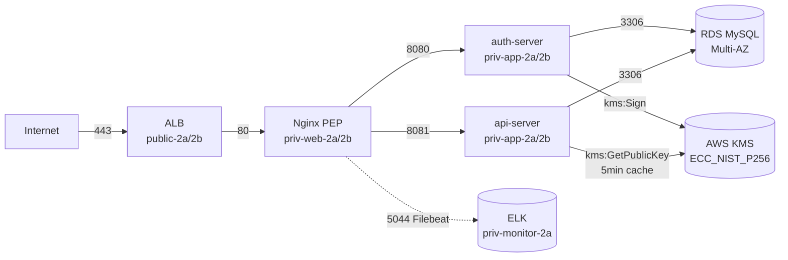
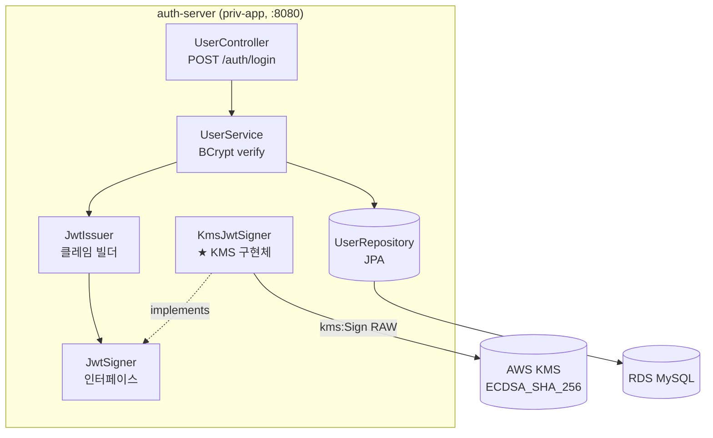
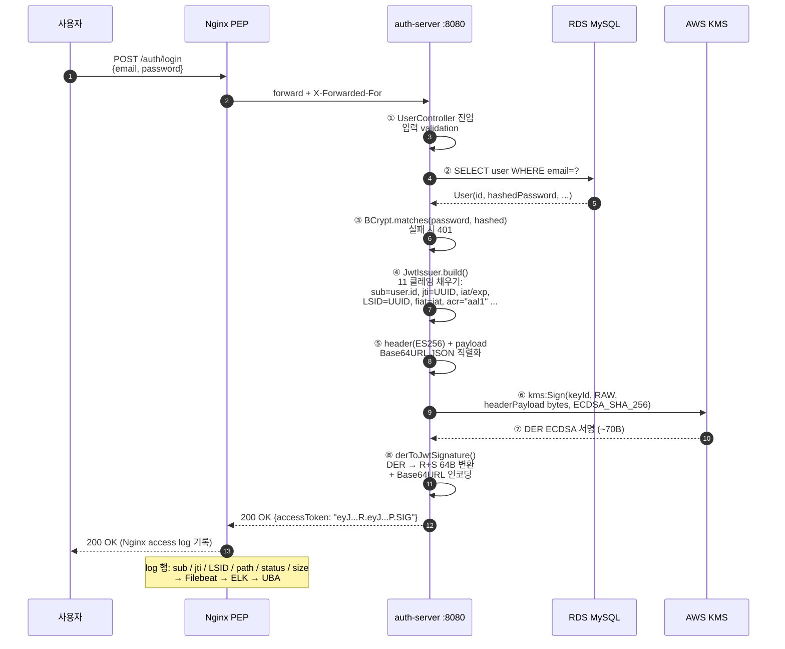
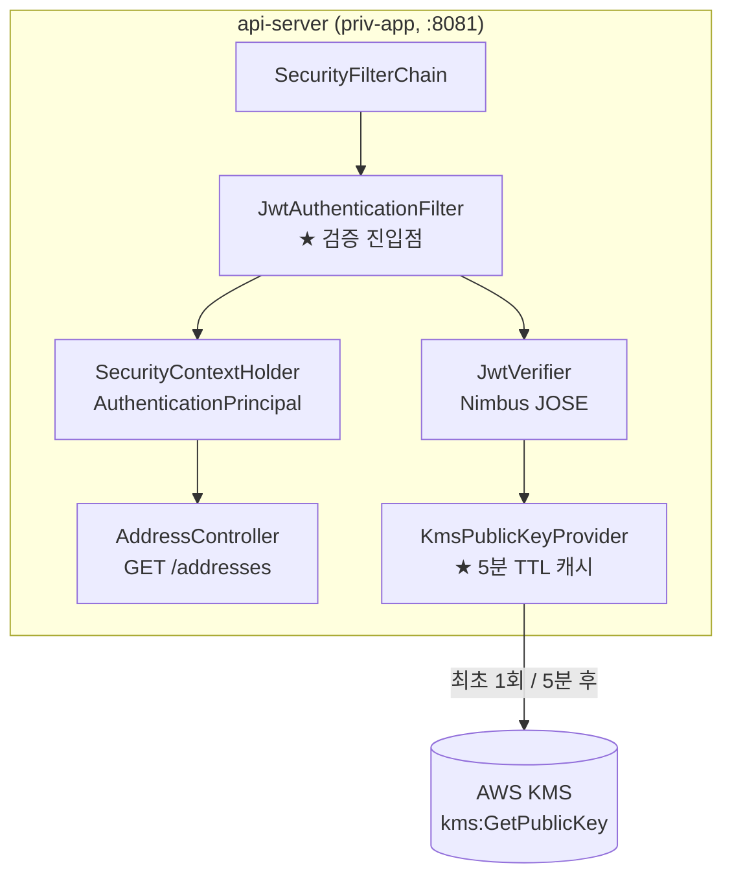
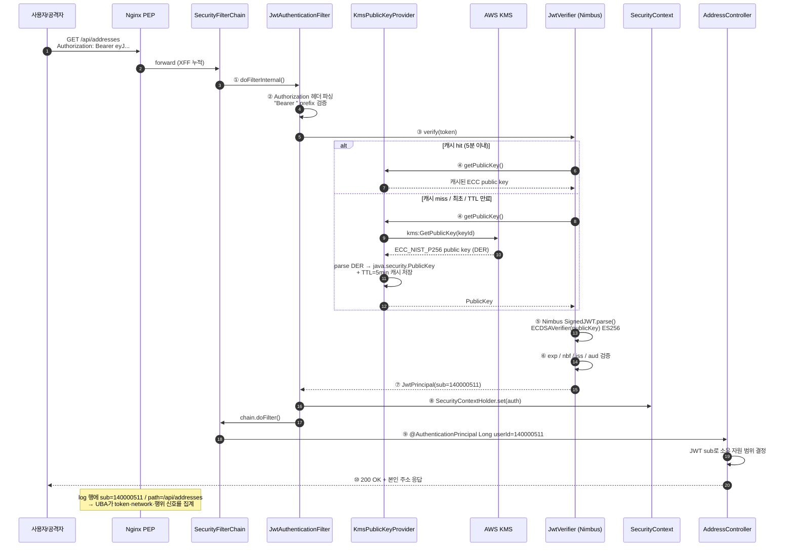

# 🛡️ ZETI Backend — Auth Server + API Server

> **ZETI (Zero Trust + UBA) — 아주대 캡스톤 / Google × Ajou AI Capstone Design**
> 2025년 쿠팡 JWT 키 유출 사고 재현 + UBA 기반 탐지 PoC 의 **백엔드 본체**

[](#)
[](#)
[](#)
[](#)

---

## ⚡ 30초 요약

본 레포는 **인증 (auth-server) + 자원 (api-server)** 두 개의 Spring Boot 서비스로 구성된 ZETI 백엔드 본체입니다. 쿠팡 사고 재현을 위해 **JWT 서명키를 AWS KMS (ES256, ECC_NIST_P256 비대칭)** 로 분리하고, 모든 자원 API는 검증된 JWT `sub`의 소유 범위에서 동작합니다.

- 🔑 **AWS KMS ES256 서명**: auth-server 는 `kms:Sign` 만, api-server 는 `kms:GetPublicKey` 만 — 키 분리 원칙
- 🪪 **JWT 11 클레임 풀 페이로드**: `sub / jti / ext.LSID / acr / amr / fiat …` — 쿠팡 실 페이로드 리버스 그대로
- 🧪 **JWT 위협 실험 자산**: 순차 `sub`, MOCK OTP `"123456"`, 문서화된 키 유출 재현 자산과 민감 응답 fixture
- 🏗️ **AWS Multi-AZ**: 단일 VPC · priv-app 2a/2b · RDS MySQL Multi-AZ · ALB → Nginx PEP → App
- 🧪 **시연 스크립트 자동화**: `scripts/all.sh` 1줄로 signup → login → 자기 자원 조회 → 부정 토큰 → 위조 토큰 흐름 검증

> ⚠️ 순차 `sub`, MOCK OTP, `door_password` 응답과 문서화된 키 유출 재현 자산은 실험 계약입니다. 자원 API의 소유권 검사는 항상 유지합니다.

> 전체 네 개 활성 저장소(backend·log-pipeline·attack-simulation·zero-trust-architecture)의 아키텍처는 [`docs/C4-as-is.md`](docs/C4-as-is.md)와
> [`docs/c4-to-be.md`](docs/c4-to-be.md)에서 Context → Container → Component → Deployment 순서로 설명합니다.
> 웹 인증 재설계 제안은 [`docs/auth-token-architecture.md`](docs/auth-token-architecture.md)를 참고하세요.
> BFF의 토큰 저장·세션·갱신·폐기와 탐지 입력 변경을 다루며, 아직 구현·배포된 구조는 아닙니다.

---

## 🎬 Live Demo — 시연 흐름

```bash
cd backend/scripts
./all.sh        # 01_signup → 02_login → 03_self → 06_negative → 07_forged_token
```

| Step | 스크립트 | 시연 메시지 | 기대 결과 |
|------|---------|------------|----------|
| 1 | `01_signup.sh` | 신규 사용자 가입 | 200 OK (이미 가입은 PASS, 멱등) |
| 2 | `02_login.sh` | ES256 JWT 발급 | 토큰 추출, `scripts/.token` 저장 |
| 3 | `03_self.sh` | 본인 데이터 조회 (정상 경로) | 200 OK, 자기 데이터만 |
| 4 | `06_negative.sh` | 토큰 없는/잘못된 호출 | 401 (정상 거부) |
| 5 | `07_forged_token.sh` | **유출된 실험 키로 victim `sub` 토큰 위조** | 자기 자원 API에서 victim 데이터 반환 |

→ 4 ~ 5 단계의 비정상 트래픽이 **`log-pipeline` 으로 흘러 들어가 v2 이상탐지(서비스 이벤트 IsolationForest)가 탐지**하고, incident로 묶여 LLM 보고까지 이어집니다. 이 시연 흐름이 **ZETI 전체 시스템의 input event** 입니다.

---

## 🏗️ 1. AWS 인프라 위치

본 backend 두 서비스는 **priv-app tier** (10.0.21.0/24, 10.0.22.0/24) 에 배치되어 ALB → Nginx PEP 를 거친 트래픽만 받습니다. RDS 는 priv-db tier 로 한 단계 더 격리 — Zero Trust SG 체인이 강제됩니다.


```mermaid
flowchart LR
    Internet -->|443| ALB[ALB<br/>public-2a/2b]
    ALB -->|80| NGX[Nginx PEP<br/>priv-web-2a/2b]
    NGX -->|8080| AUTH[auth-server<br/>priv-app-2a/2b]
    NGX -->|8081| API[api-server<br/>priv-app-2a/2b]
    AUTH -->|3306| RDS[(RDS MySQL<br/>Multi-AZ)]
    API -->|3306| RDS
    AUTH -->|kms:Sign| KMS[(AWS KMS<br/>ECC_NIST_P256)]
    API -->|kms:GetPublicKey<br/>5min cache| KMS
    NGX -.5044 Filebeat.-> ELK[(ELK<br/>priv-monitor-2a)]
```

### SG 체인 (Zero Trust 핵심)

```
alb-sg  ──80──>  nginx-sg  ──8080/8081──>  app-sg  ──3306──>  db-sg
```

> **인바운드는 항상 SG 참조 (IP 아님).** IP 변경에 무관, ZT "신원 기반"에 부합.

---

## 🔀 2. 서비스 구조

| 서비스 | 포트 | 책임 | KMS 권한 |
|--------|------|------|---------|
| **auth-server** | 8080 | 회원가입 · 로그인 · **JWT 발급** · MOCK OTP step-up | `kms:Sign` + `kms:GetPublicKey` |
| **api-server** | 8081 | 자원 조회 · 주문 · 결제 · 마이페이지 · **JWT 검증** | `kms:GetPublicKey` 만 (5분 캐시) |

**원칙**: api-server 는 Sign 권한을 절대 가지지 않습니다 → 토큰 발급 불가, 검증만. 키 누출 발생 면 자체가 축소됩니다.

---

## 🔐 3. JWT 발급 흐름 — auth-server (kms:Sign)

### 3-1. 컴포넌트 관계


```mermaid
flowchart TB
    subgraph AS["auth-server (priv-app, :8080)"]
        UC[UserController<br/>POST /auth/login]
        US[UserService<br/>BCrypt verify]
        UR[(UserRepository<br/>JPA)]
        JI[JwtIssuer<br/>클레임 빌더]
        JS[JwtSigner<br/>인터페이스]
        KJS[KmsJwtSigner<br/>★ KMS 구현체]
        UC --> US --> UR
        US --> JI --> JS
        KJS -.implements.-> JS
    end
    KMS[(AWS KMS<br/>ECDSA_SHA_256)]
    KJS -->|kms:Sign RAW| KMS
    UR --> DB[(RDS MySQL)]
```

### 3-2. 시퀀스 — 로그인 → JWT 발급 (8 step)


```mermaid
sequenceDiagram
    autonumber
    participant U as 사용자
    participant NGX as Nginx PEP
    participant AS as auth-server :8080
    participant DB as RDS MySQL
    participant KMS as AWS KMS

    U->>NGX: POST /auth/login<br/>{email, password}
    NGX->>AS: forward + X-Forwarded-For
    AS->>AS: ① UserController 진입<br/>입력 validation
    AS->>DB: ② SELECT user WHERE email=?
    DB-->>AS: User(id, hashedPassword, ...)
    AS->>AS: ③ BCrypt.matches(password, hashed)<br/>실패 시 401
    AS->>AS: ④ JwtIssuer.build()<br/>11 클레임 채우기:<br/>sub=user.id, jti=UUID, iat/exp,<br/>LSID=UUID, fiat=iat, acr="aal1" ...
    AS->>AS: ⑤ header(ES256) + payload<br/>Base64URL JSON 직렬화
    AS->>KMS: ⑥ kms:Sign(keyId, RAW,<br/>headerPayload bytes, ECDSA_SHA_256)
    KMS-->>AS: ⑦ DER ECDSA 서명 (~70B)
    AS->>AS: ⑧ derToJwtSignature()<br/>DER → R+S 64B 변환<br/>+ Base64URL 인코딩
    AS-->>NGX: 200 OK {accessToken: "eyJ...R.eyJ...P.SIG"}
    NGX-->>U: 200 OK (Nginx access log 기록)

    Note over NGX: log 행: sub / jti / LSID / path / status / size<br/>→ Filebeat → ELK → UBA
```

> **시그니처 변환의 까다로움**: KMS 가 돌려주는 DER 인코딩 (`30 [len] 02 [Rlen] R 02 [Slen] S`) 을 JWT 표준 R+S 64B (R 32B + S 32B, leading zero 패딩 처리) 로 변환해야 Nimbus 검증과 호환됩니다 — `KmsJwtSigner.derToJwtSignature()` 가 그 변환을 담당.

---

## 🪪 4. JWT 검증 흐름 — api-server (kms:GetPublicKey)

### 4-1. 컴포넌트 관계


```mermaid
flowchart TB
    subgraph API["api-server (priv-app, :8081)"]
        AC[AddressController<br/>GET /addresses]
        SF[SecurityFilterChain]
        JAF[JwtAuthenticationFilter<br/>★ 검증 진입점]
        JV[JwtVerifier<br/>Nimbus JOSE]
        KPP[KmsPublicKeyProvider<br/>★ 5분 TTL 캐시]
        SC[SecurityContextHolder<br/>AuthenticationPrincipal]
    end
    KMS[(AWS KMS<br/>kms:GetPublicKey)]
    KPP -->|최초 1회 / 5분 후| KMS
    SF --> JAF --> JV
    JV --> KPP
    JAF --> SC --> AC
```

### 4-2. 시퀀스 — Bearer 토큰 → 200 OK (10 step)


```mermaid
sequenceDiagram
    autonumber
    participant U as 사용자/공격자
    participant NGX as Nginx PEP
    participant SF as SecurityFilterChain
    participant JAF as JwtAuthenticationFilter
    participant KPP as KmsPublicKeyProvider
    participant KMS as AWS KMS
    participant JV as JwtVerifier (Nimbus)
    participant SC as SecurityContext
    participant CTRL as AddressController

    U->>NGX: GET /api/addresses<br/>Authorization: Bearer eyJ...
    NGX->>SF: forward (XFF 누적)
    SF->>JAF: ① doFilterInternal()
    JAF->>JAF: ② Authorization 헤더 파싱<br/>"Bearer " prefix 검증
    JAF->>JV: ③ verify(token)

    alt 캐시 hit (5분 이내)
        JV->>KPP: ④ getPublicKey()
        KPP-->>JV: 캐시된 ECC public key
    else 캐시 miss / 최초 / TTL 만료
        JV->>KPP: ④ getPublicKey()
        KPP->>KMS: kms:GetPublicKey(keyId)
        KMS-->>KPP: ECC_NIST_P256 public key (DER)
        KPP->>KPP: parse DER → java.security.PublicKey<br/>+ TTL=5min 캐시 저장
        KPP-->>JV: PublicKey
    end

    JV->>JV: ⑤ Nimbus SignedJWT.parse()<br/>ECDSAVerifier(publicKey) ES256
    JV->>JV: ⑥ exp / nbf / iss / aud 검증
    JV-->>JAF: ⑦ JwtPrincipal(sub=140000511)
    JAF->>SC: ⑧ SecurityContextHolder.set(auth)
    JAF->>SF: chain.doFilter()
    SF->>CTRL: ⑨ @AuthenticationPrincipal Long userId=140000511
    CTRL->>CTRL: JWT sub로 소유 자원 범위 결정
    CTRL-->>U: ⑩ 200 OK + 본인 주소 응답

    Note over NGX: log 행에 sub=140000511 / path=/api/addresses<br/>→ UBA가 token·network·행위 신호를 집계
```

> **5 분 캐시의 이유**: `kms:GetPublicKey` 는 무료지만 매 요청 호출 시 latency (KMS 콜 ~30ms) 가 추가됩니다. 공개키는 **회전되지 않는 한 불변** 이므로 TTL 캐시가 안전. 회전 시점에는 캐시 invalidate 가 필요하지만 현 PoC 범위 외.

> **자원 인가 계약**: collection과 프로필 API는 JWT `sub`에서 사용자 범위를 얻습니다. 주소 수정과 주문 상세 조회처럼 객체 ID가 필요한 API는 repository query에서 객체 ID와 소유자 ID를 함께 검증합니다.

---

## 🔐 5. AWS KMS 통합 — Why / How

### Why KMS

| 항목 | Before (하드코딩 키) | After (KMS ES256) |
|------|---------------------|------------------|
| 키 저장 | 코드/yaml 평문 (Git 가능) | KMS HSM, **export 불가** |
| 키 회전 | 수동 + 배포 | KMS API 1 회 호출 |
| 권한 분리 | 동일 키 = Sign + Verify | **Sign / GetPublicKey 분리** |
| 사용 감사 | 없음 | CloudTrail 자동 |
| 알고리즘 | HS256 (대칭) | **ES256 (ECC_NIST_P256 비대칭)** |
| 쿠팡 사고 재현성 | "키 누출 = 즉시 위조 가능" | "키 누출이라도 KMS 분리로 격리" |

### How — auth-server `KmsJwtSigner` 핵심 코드

```java
SignRequest request = SignRequest.builder()
    .keyId(keyId)                                          // alias/jwt-signing-key-external
    .messageType(MessageType.RAW)
    .message(SdkBytes.fromByteArray(headerPayload.getBytes()))
    .signingAlgorithm(SigningAlgorithmSpec.ECDSA_SHA_256)
    .build();
byte[] der = kmsClient.sign(request).signature().asByteArray();
byte[] jwtSig = derToJwtSignature(der);   // DER → R+S (64B) 변환
return Base64.getUrlEncoder().withoutPadding().encodeToString(jwtSig);
```

### KMS 키 정보 (변경 금지)

| 항목 | 값 |
|------|---|
| Key ID | `e111ced9-d9ed-4af6-9ab4-d429b606f80e` |
| Alias | `alias/jwt-signing-key-external` |
| Region | `ap-northeast-2` |
| KeySpec | `ECC_NIST_P256` |
| KeyUsage | `SIGN_VERIFY` |
| auth-server 액션 | `kms:Sign` + `kms:GetPublicKey` |
| api-server 액션 | `kms:GetPublicKey` **만** |

---

## 🪪 6. JWT 페이로드 — 쿠팡 실 페이로드 그대로

```json
{
  "sub": "140000511",
  "jti": "0d93a42a-adbe-4b1f-91f1-...",
  "iat": 1778056393,
  "exp": 1778056993,           // TTL 600초 / 10분
  "auth_time": 1778056393,
  "nbf": 1778056393,
  "iss": "https://auth.zeti.com/",
  "aud": ["https://api.zeti.com"],
  "client_id": "zeti-web",
  "scp": ["openid", "core"],
  "acr": "aal1",               // 인증 강도 (UBA 신호)
  "amr": ["pwd"],              // 인증 방법
  "ext": {
    "LSID": "d8fa308d-4a3e-...",   // 세션 단위 추적자 (UBA 핵심)
    "fiat": 1778056393,            // 최초 인증 시각
    "v": 2
  }
}
```

| 클레임 | UBA 활용 |
|--------|---------|
| `sub` | 사용자 단위 행위 집계 |
| `jti` | 토큰 단위 추적, **재사용 패턴 탐지** |
| `ext.LSID` | **세션 단위 추적자** — 단일 세션에서 다중 IP/토큰 사용 탐지 |
| `ext.fiat` | 최초 인증 이후 경과 시간 (이상 행위 시점 보정) |
| `acr`, `amr` | 인증 강도/방법 (MFA 우회 시도 탐지) |
| `iat`, `exp` | 토큰 발급 빈도, 단명 토큰 남발 |

---

## 🚨 7. 보존하는 실험 자산

| ID | 위치 | 취약점 | UBA 검증 신호 |
|----|------|--------|--------------|
| **V1** | 전 코드 (잔재) | **하드코딩 JWT 서명키** (KMS 전환 전) | 단일 위조 토큰의 비정상 페이로드 검출 |
| **V2** | `User.id : Long` | **순차 정수 PK** (`sub = 140000xxx`) | 글로벌 sub 단조 시퀀스 → enumeration factor |
| **V4** | `POST /auth/stepup` | **MOCK OTP `"123456"`** | step-up 우회 시도 패턴 |

> `door_password` 평문 응답은 **키 유출 후 데이터 접근의 영향**을 관측하는 fixture입니다. 접근 대상은 항상 검증된 token `sub`의 소유 범위로 제한합니다.

### TO-BE (장기 계획, 본 PoC 범위 외)

| 항목 | TO-BE |
|------|-------|
| V1 (하드코딩 키) | ✅ **AWS KMS 로 전환 완료** (auth-server `KmsJwtSigner`) |
| V2 (순차 PK) | UUID 랜덤 (점진 migration) |
| V4 (MOCK OTP) | 실 TOTP / Twilio SMS |

---

## 📦 8. 디렉토리 구조

두 서비스 모두 **도메인을 먼저 찾고**, 그 안에서 계층을 따라가도록 구성합니다.
각 bounded context의 `package-info.java`에는 그 패키지가 소유하는 책임과 실험 계약을 짧게 기록합니다.

```
backend/
├── auth-server/                          # 🔐 JWT 발급 + KMS Sign
│   ├── src/main/java/com/zeti/auth/
│   │   ├── AuthServerApplication.java
│   │   ├── identity/                     # 회원가입·로그인 bounded context
│   │   │   ├── presentation/             # AuthController
│   │   │   ├── application/              # AuthService + 요청/응답 DTO
│   │   │   ├── domain/                   # User
│   │   │   └── infrastructure/persistence/ # UserRepository
│   │   ├── token/                        # JWT 발급·KMS 서명 bounded context
│   │   │   ├── application/              # JwtIssuer
│   │   │   │   └── port/outbound/        # JwtSigner 포트
│   │   │   └── infrastructure/kms/       # KmsJwtSigner
│   │   ├── health/presentation/          # HelloController
│   │   └── global/
│   │       ├── config/                   # SecurityConfig, JwtConfig
│   │       └── exception/                # GlobalExceptionHandler
│   ├── docker-compose.yml                # 로컬 MySQL
│   └── build.gradle.kts
│
├── api-server/                           # 🪪 JWT 검증 + 자기 자원 범위 도메인 API
│   ├── src/main/java/com/zeti/api/
│   │   ├── ApiServerApplication.java
│   │   ├── address/                      # 배송지·소유권 검증
│   │   ├── user/                         # 사용자 프로필 자기 자원 API
│   │   ├── order/                        # 주문 조회·소유권 검증
│   │   ├── payment/                      # 결제수단·결제내역
│   │   │   ├── presentation/             # HTTP Controller
│   │   │   ├── application/              # Service + application/dto
│   │   │   ├── domain/                   # JPA Entity + Enum
│   │   │   └── infrastructure/persistence/ # Spring Data Repository
│   │   ├── mypage/                       # 여러 도메인을 조합하는 read model
│   │   │   ├── presentation/
│   │   │   └── application/
│   │   ├── security/                     # Bearer JWT 검증 경계
│   │   │   ├── presentation/             # JwtAuthenticationFilter
│   │   │   ├── application/              # JwtVerifier
│   │   │   └── infrastructure/kms/       # KmsPublicKeyProvider
│   │   ├── health/presentation/
│   │   └── global/config/                # SecurityConfig, AwsConfig
│   └── compose.yaml
│
├── scripts/                              # 🎬 시연 스크립트 (모노레포 루트)
│   ├── env.sh                            # ZETI_ALB_URL, TEST_EMAIL 등
│   ├── 01_signup.sh ~ 07_forged_token.sh
│   ├── all.sh                            # 일괄 시연
│   ├── forge_token.py                    # 하드코딩 키 위조 (V1 시연)
│   ├── decode_token.py                   # 11 클레임 디코더
│   └── README.md
│
├── docs/                                 # ZETTY 전체 시스템 C4 문서
│   ├── C4-as-is.md                       # 현재 runtime·data·deployment 구조
│   ├── c4-to-be.md                       # 목표 구조·계약·전환 순서
│   └── README.md                         # 문서 범위와 표기 규칙
│
└── README.md                             # 전체 계약·실행·구조 가이드
```

### 코드를 읽는 순서

| 계층 | 질문 | 대표 파일 |
|------|------|-----------|
| `presentation` | 어떤 HTTP 요청을 받고 무엇을 반환하는가? | [`AddressController`](api-server/src/main/java/com/zeti/api/address/presentation/AddressController.java) |
| `application` | 어떤 유스케이스와 트랜잭션을 실행하는가? | [`AddressService`](api-server/src/main/java/com/zeti/api/address/application/AddressService.java) |
| `domain` | 데이터와 업무 상태 변경 규칙은 무엇인가? | [`Address`](api-server/src/main/java/com/zeti/api/address/domain/Address.java) |
| `infrastructure` | DB·KMS 같은 외부 시스템을 어떻게 연결하는가? | [`AddressRepository`](api-server/src/main/java/com/zeti/api/address/infrastructure/persistence/AddressRepository.java), [`KmsJwtSigner`](auth-server/src/main/java/com/zeti/auth/token/infrastructure/kms/KmsJwtSigner.java) |
| `global` | 여러 도메인에 공통인 Spring 조립은 무엇인가? | [`SecurityConfig`](api-server/src/main/java/com/zeti/api/global/config/SecurityConfig.java) |

`mypage`는 자체 Entity를 가지지 않고 여러 도메인의 application 결과를 조합하는 조회 유스케이스입니다.
이번 구조는 이해하기 쉬운 **DDD-lite 첫 단계**로, JPA Entity와 Spring Data Repository의 프레임워크 결합은
유지합니다. 추후 엄격한 hexagonal 구조가 필요할 때 repository port와 JPA adapter를 분리할 수 있습니다.

---

## 🛠️ 9. Tech Stack

| Category | Stack | 비고 |
|----------|-------|------|
| **Language** | Java 17 (Amazon Corretto) | 고정 |
| **Framework** | Spring Boot 3.5.x + Spring Security | |
| **Build** | Gradle Wrapper (auth: Kotlin DSL, api: Groovy DSL) | Maven 금지 |
| **DB** | MySQL 8 (로컬 Docker · EC2 RDS Multi-AZ) | priv-db tier |
| **JWT 라이브러리** | **Nimbus JOSE JWT 9.x** 만 | jjwt 금지 |
| **AWS SDK** | AWS SDK for Java v2 | KMS · RDS · SSM |
| **Crypto** | AWS KMS · `ECC_NIST_P256` · `ES256` | 비대칭 고정 |
| **접근** | AWS Session Manager (SSM) — **SSH 키 없음, 베스천 없음** | ZT 원칙 |
| **CI/CD** | GitHub Actions | 각 서비스 빌드 검증 |

---

## 🧭 10. Why → How → Impact → Deliverable

### 1️⃣ Why — 쿠팡 사고가 보여준 백엔드의 구조적 결함

| 사고 패턴 | 본 backend 가 재현하는 결함 |
|----------|---------------------------|
| 7개월간 JWT 키로 무차별 토큰 위조 | **V1** 하드코딩 키 (KMS 전환 전) |
| 사용자 ID 순차 9자리 정수 → 열거 자명 | **V2** `Long id` (sub=140000xxx) |
| 키 유출 후 임의 사용자로 토큰 위조 | 위조 token `sub`로 자기 자원 API 호출 |
| MFA 우회 시나리오 | **V4** MOCK OTP `"123456"` |

### 2️⃣ How — Zero Trust + KMS + UBA 탐지 인터페이스

- **KMS 전환**: 동일 서명 의미 유지하며 키만 HSM 로 이동 (`auth-server/src/main/java/com/zeti/auth/token/infrastructure/kms/KmsJwtSigner.java`)
- **SG 체인**: ALB → Nginx → App → DB **5 단 분리** + 모든 인바운드는 SG 참조
- **로그 흐름 표준화**: Nginx custom log + 11 JWT 클레임 → Filebeat → ES ingest pipeline `jwt-decode` → `filebeat-*` 색인
- **탐지 신호 명시**: 위조·탈취 token의 `sub`, `jti`, network fan-out과 요청량을 v2 IsolationForest 이상탐지의 입력 특징으로 사용

### 3️⃣ Impact — 두 축 방어 체계의 백엔드 기여

| KPI | Before (쿠팡 시점) | After (ZETI backend) |
|-----|-------------------|---------------------|
| 키 누출 시 즉시 위조 가능성 | ✅ (서버 코드에 키) | ❌ (KMS HSM, export 불가) |
| 키 회전 가능 시점 | 배포 주기 (주 단위) | KMS API 1 콜 |
| 자원 인가 | path 사용자 ID를 받는 공개 API | JWT `sub` 기반 자기 자원 + repository 소유권 query |
| 사용자 ID 추측 난이도 | 순차 (자명) | 동일 (TO-BE 에서 UUID 전환) — **탐지로 보완** |

### 4️⃣ Deliverable — 탐지 파이프라인이 소비하는 데이터 계약

본 backend 가 산출하고 다른 레포가 의존하는 인터페이스:

| 산출물 | 소비처 | 형식 |
|--------|--------|------|
| **11 클레임 JWT 페이로드** | log-pipeline `jwt-decode` ingest pipeline → v2 이상탐지 | Base64URL JWT |
| **Nginx access log** | log-pipeline Filebeat | LTSV (sub, jti, LSID, path, status, size) |
| **자기 자원 endpoint** | attack-simulation 검증 시나리오의 target | `/addresses` · `/orders` · `/users/me` |
| **MOCK OTP** | attack-simulation step-up 우회 시연 | `POST /auth/stepup {code:"123456"}` |
| **KMS public key endpoint** | api-server 내부 + 외부 검증자 | `kms:GetPublicKey` (5 분 캐시) |

---

## 🚀 11. Getting Started

### Prerequisites

- Java 17 (Amazon Corretto 권장)
- Docker (로컬 MySQL)
- AWS 자격증명 (KMS 접근 — `~/.aws/credentials` 또는 환경변수)
- AWS CLI 권한: `kms:Sign` (auth) + `kms:GetPublicKey` (api)

### 로컬 개발 (Docker MySQL + 2 서비스)

```bash
# 1) auth-server
cd backend/auth-server
docker compose up -d mysql                          # 로컬 MySQL (3306)
SPRING_PROFILES_ACTIVE=local ./gradlew bootRun      # :8080

# 2) api-server (별도 터미널)
cd backend/api-server
SPRING_PROFILES_ACTIVE=local ./gradlew bootRun      # :8081

# 3) 시연 일괄 실행
cd backend/scripts
./all.sh
```

### 빌드·테스트

```bash
cd auth-server   # or api-server
./gradlew build -x test     # 빠른 빌드
./gradlew test              # 테스트 실행
./gradlew clean             # 산출물 제거
```

### EC2 운영 (priv-app tier)

EC2 인스턴스에는 **IAM 인스턴스 프로파일**로 KMS 권한이 부여됩니다. SSH 키·베스천 없이 **AWS SSM Session Manager** 로 접근:

```bash
aws ssm start-session --target i-xxxxxxxxxxxxxxxxx --region ap-northeast-2
cd /opt/zeti-backend/auth-server && SPRING_PROFILES_ACTIVE=prod ./gradlew bootRun
```

### .env / 시크릿 관리

| 시크릿 | 위치 | 비고 |
|-------|------|------|
| DB 비밀번호 | `application-local.yml` (gitignore) / SSM Parameter Store (prod) | |
| AWS 자격증명 | `~/.aws/credentials` (로컬) / IAM 인스턴스 프로파일 (EC2) | |
| KMS Key ID | `application.yml` (시크릿 아님 — 공개키만 노출) | 노출 OK |
| KMS Alias | `alias/jwt-signing-key-external` | 노출 OK |

---

## 🔗 12. 관련 레포 (ZETTY Org)

| 레포 | 본 backend 와의 관계 |
|------|----------------------|
| [`log-pipeline`](https://github.com/ZETTY-ZEROTRUST/log-pipeline) | Nginx PEP 가 backend 로그를 Filebeat → ES 로 수집·`jwt-decode` 로 11 클레임 분해하고, **v2 이상탐지**(서비스 이벤트 IsolationForest `pipeline/detector/detect.py`, incident 묶기·LLM 보고 `pipeline/detector/anomaly_incident.py`, self-contained 학습 `notebooks/rba_selfcontained_train.ipynb`)를 소유 |
| [`attack-simulation`](https://github.com/ZETTY-ZEROTRUST/attack-simulation) | 위조·탈취·비정상 수명 JWT를 사용하는 승인된 검증 트래픽 발사 |
| [`zero-trust-architecture`](https://github.com/ZETTY-ZEROTRUST/zero-trust-architecture) | AWS 인프라 IaC (Terraform) — VPC / SG 체인 / ALB + WAF / Route53 / KMS — backend 가 올라가는 priv-app tier 정의 |
| [`.github`](https://github.com/ZETTY-ZEROTRUST/.github) | Org Overview README |

---

## 📋 13. 컴플라이언스 / 표준 매핑

| 표준 | 통제 항목 | 본 레포의 충족 방식 |
|------|----------|---------------------|
| **KISA Zero Trust Guideline 2.0** | 신원 기반 인가 + 명시적 검증 | KMS ES256 + Bearer + SG 체인 |
| **NIST SP 800-207** | PEP/PDP 분리, micro-segmentation | priv-app/priv-db tier 분리, SG 참조 |
| **OWASP API1:2023 BOLA** | 객체 소유권 검증 | 자기 자원 API와 repository 소유권 query로 예방 |
| **OWASP A02: Cryptographic Failures** | 키 관리 | **AWS KMS HSM** + 권한 분리 (Sign/Verify) |
| **MITRE ATT&CK T1078 (Valid Accounts)** | 탈취 토큰 사용 | attack-simulation 탈취 토큰 시나리오 + log-pipeline v2 이상탐지 |

---

## 🤝 14. 기여 가이드

### 절대 규칙 (DO NOT)

- ❌ 순차 `sub`, MOCK OTP, 민감 응답 fixture와 문서화된 키 유출 재현 자산을 임의 변경 금지
- ❌ **`door_password` 평문 제거/암호화/마스킹 금지**
- ❌ **JWT 알고리즘 HS256 등 대칭키로 변경 금지** (ES256 고정)
- ❌ **jjwt 라이브러리 사용 금지** — Nimbus JOSE 만
- ❌ **Maven 마이그레이션 금지** — Gradle 고정
- ❌ path/query에서 받은 사용자 ID로 인증 주체 범위를 대체 금지
- ❌ **AWS Account ID, IAM User 이름 하드코딩 금지**
- ❌ **사용자 승인 없이 `git commit`/`git push` 실행 금지**

### 커밋 컨벤션

- 포맷: `<type>(<scope>): <한글 제목>`
- scope: `auth` (auth-server) / `api` (api-server) / `kms` / `db` / `repo`
- 예: `feat(api): KMS 공개키 fetch 컴포넌트 추가`
- 제목은 한글, 50자 이내, 마침표 없음, 명령형
- 한 commit = 한 의도

---

> **본 backend 는 ZETI Zero Trust SOC 의 _공격 표면_ 이자 _데이터 원천_ 입니다.**
> 의도된 취약점으로 쿠팡 공격 벡터를 재현하고, KMS 로 키 관리를 격리하며, 11 클레임 JWT 로 UBA 가 소비할 풍부한 신호를 제공합니다. 그리고 그 모든 결정 — _수정하지 않는 결정_ 까지 포함 — 은 명시적입니다.
