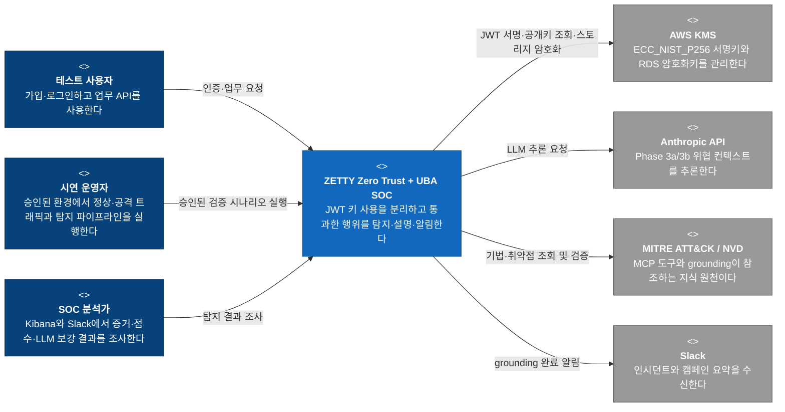
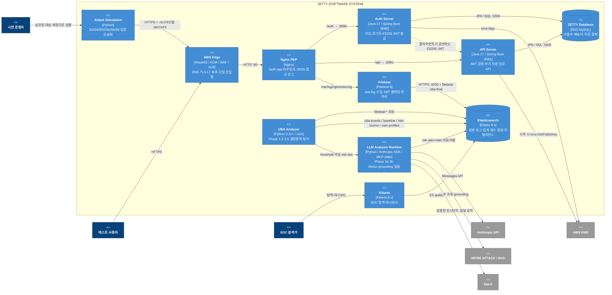
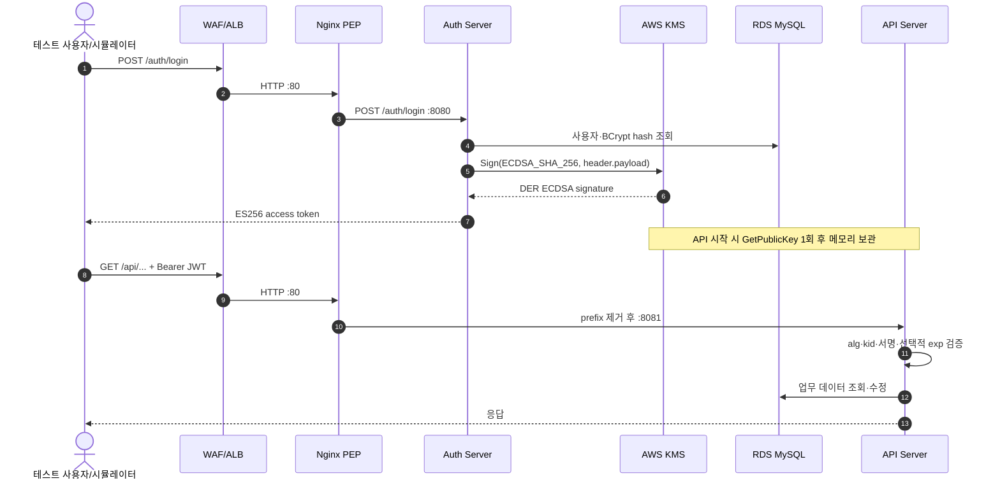
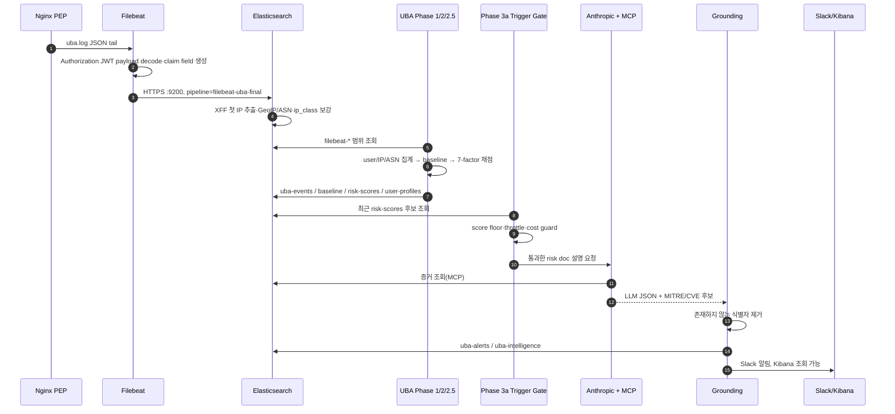
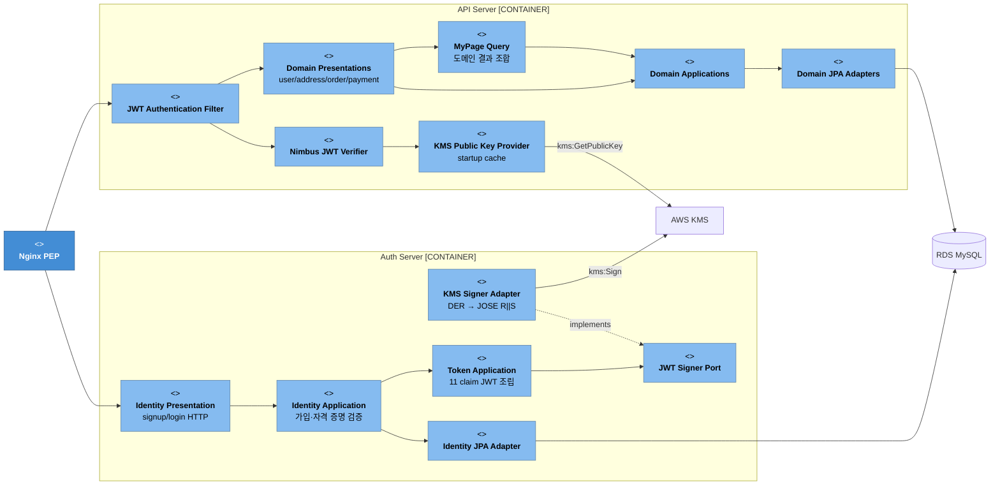
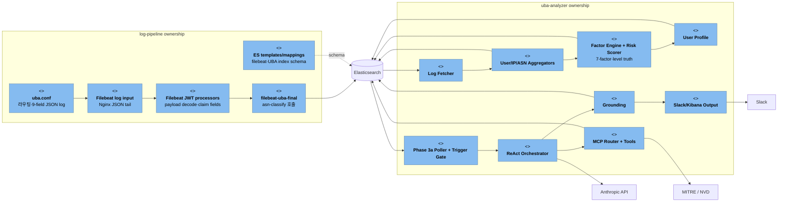
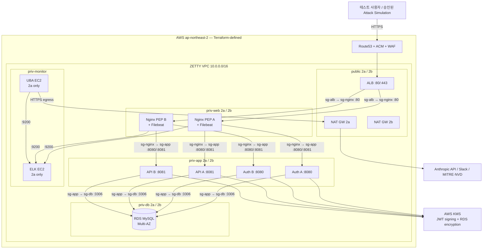

# ZETTY 전체 시스템 — AS-IS C4 Architecture

> 기준일: 2026-08-29 
> 상태: 여섯 저장소의 현재 코드·설정·매핑·Terraform을 대조한 구조 
> 주의: AWS·Elasticsearch·Slack의 현재 운영 상태를 조회한 문서가 아니다. Deployment View는 Terraform이 **정의한 토폴로지**이며 live 배포 확인 결과가 아니다.

## 1. 범위와 읽는 법

이 문서의 Software System 경계는 `backend` 하나가 아니라 **ZETTY Zero Trust + UBA SOC PoC 전체**다. ZETTY는 AWS KMS ES256으로 JWT 서명키 노출 면을 줄이고, 정상 토큰이나 의도된 취약점을 통과한 행위를 Nginx·Filebeat·Elasticsearch·7-factor UBA·LLM으로 탐지해 SOC 분석가에게 알리는 시스템이다.

핵심 범위는 다음과 같다.

- 선제 통제: Auth Server만 KMS 서명을 소유하고 API Server는 공개키로 ES256 JWT를 검증한다.
- 사후 탐지: 모든 요청을 Nginx JSON 로그로 남기고, UBA가 결정론적 7-factor 점수와 공격자 등급을 계산한다.
- LLM 보강: LLM은 점수를 재계산하지 않고 설명·MITRE/CVE 컨텍스트를 보강하며, grounding 뒤에만 외부로 내보낸다.
- 검증: 승인된 ZETTY 테스트 환경에서 S2/S4/S5/S5b/S6/S8 시나리오와 KPI로 탐지 성능을 확인한다.
- 종료점: Elasticsearch·Kibana·Slack의 **탐지와 알림**까지다. 자동 차단·격리·학습은 포함하지 않는다.

### 저장소와 C4 요소의 관계

Git 저장소는 소스 소유 단위이고 C4 Container는 실행·데이터 단위다. 따라서 “저장소 하나 = Container 하나”로 그리지 않는다.

| 저장소 | 현재 소유 책임 | C4에서의 위치 |
|---|---|---|
| `.github/` | 조직 소개, 전체 목적과 저장소 간 계약 | 문서·거버넌스. 런타임 Container 아님 |
| `zero-trust-architecture/` | VPC, SG, ALB/WAF, EC2, RDS, KMS Terraform | Deployment 정의. 런타임 자원을 생성하는 코드 |
| `backend/` | Auth Server와 API Server | 업무·인증 Container |
| `log-pipeline/` | Nginx PEP, Filebeat, Elasticsearch ingest·mapping | 진입점과 Telemetry Container·데이터 계약 |
| `uba-analyzer/` | 집계, 7-factor, LLM ReAct, grounding, Slack·Kibana 자산 | 탐지·분석 Container |
| `attack-simulation/` | S2/S4/S5/S5b/S6/S8 및 시연 자동화 | 승인된 검증 트래픽 Container |

## 2. Level 1 — System Context

이 다이어그램은 ZETTY 전체가 누구에게 어떤 가치를 제공하고 어떤 외부 시스템에 의존하는지 보여준다.

Context에서 AWS VPC, Nginx, Spring Boot, Elasticsearch 같은 요소가 보이지 않는 이유는 모두 ZETTY 내부 Container 또는 Deployment Node이기 때문이다. `attack-simulation`도 외부 공격자가 아니라 이 PoC가 소유한 승인된 검증 도구다.

## 3. Level 2 — Container

### 전체 런타임과 데이터 흐름

### Container 책임과 소유 저장소

| Container | 소유 저장소 | 입력 | 출력·책임 |
|---|---|---|---|
| Attack Simulation | `attack-simulation` | 운영자가 승인한 대상·시나리오·테스트 자산 | 정상 토큰 재사용 또는 ES256 위조 요청, 로컬 JSONL 결과 |
| AWS Edge | `zero-trust-architecture` | 인터넷 HTTPS | WAF 평가, TLS 종료, Nginx target group 전달 |
| Nginx PEP | `log-pipeline` | `/auth/*`, `/api/*` | Auth/API 프록시와 `uba_log` JSON 기록 |
| Filebeat | `log-pipeline` | Nginx `uba.log` | JWT claim 전처리 후 `filebeat-*` 색인 요청 |
| Auth Server | `backend` | signup/login | 사용자 저장, ES256 JWT 조립, KMS ECDSA 서명 |
| API Server | `backend` | Bearer JWT와 업무 요청 | Nimbus 로컬 서명 검증, 사용자·배송지·주문·결제 응답 |
| ZETTY Database | `zero-trust-architecture`가 RDS 배포, `backend`가 schema 사용 | Auth/API JPA | 관계형 업무 데이터 |
| Elasticsearch | `log-pipeline`이 ingest·mapping 소유, `uba-analyzer`가 탐지 문서 생성 | Filebeat와 UBA 쓰기 | 원본 관측과 탐지 증거 저장 |
| Kibana | `uba-analyzer`가 dashboard 자산 소유 | Elasticsearch 문서 | 분석가용 탐색·시각화 |
| UBA Analyzer | `uba-analyzer` | `filebeat-*` | 집계, baseline, 7-factor, `attacker_level`, 사용자 프로필 |
| LLM Analysis Runtime | `uba-analyzer` | 임계 이상 risk doc·24h alert bundle | grounding된 alert/intelligence, Slack 메시지 |

## 4. 주요 런타임 시퀀스

### JWT 발급과 업무 요청

Auth와 API 사이에 직접 런타임 호출은 없다. 협력 계약은 클라이언트가 운반하는 JWT와 공유 데이터 schema다. collection·프로필 API는 JWT `sub`로 사용자 범위를 정하고, 객체 ID 기반 수정·상세 조회는 repository query에서 소유자 ID를 함께 검증한다.

### 로그 수집부터 SOC 알림까지

점수·`factor_breakdown`·`dominant_factor`·`attacker_level`의 결정권은 UBA의 Python 계층에 있다. LLM이 반환한 같은 이름의 값은 진실 원천이 아니며 외부 출력 전에 결정론적 값을 유지한다.

## 5. Level 3 — 핵심 Component

모든 Container를 클래스 수준까지 펼치지 않고, 저장소 간 계약을 이해하는 데 필요한 부분만 표시한다.

### Backend — 인증·업무 API

### Log Pipeline + UBA — 관측·탐지·설명

## 6. Deployment View — Terraform이 정의한 AWS 토폴로지

아래는 `zero-trust-architecture/terraform`의 코드 정의다. 실제 AWS 리소스의 현재 존재·버전·상태를 확인한 결과로 읽으면 안 된다. 이 Terraform은 기존 콘솔 자원을 먼저 import해야 하는 local-state PoC다.

현재 토폴로지 정의는 Edge·App·RDS를 두 AZ에 걸치지만 ELK와 UBA는 `priv-monitor-2a` 단일 EC2다. 따라서 전체 탐지 경로가 Multi-AZ라고 표현할 수는 없다.

## 7. 저장소 간 계약

| 계약 | Producer | Consumer | 현재 형식·소유 기준 |
|---|---|---|---|
| HTTP path | `backend` | Nginx, attack scenarios, UBA endpoint sensitivity | `/auth/*`, `/api/*`; Nginx가 `/api/` prefix 제거 후 API에 전달 |
| JWT header·claim | Auth Server | API Server, Filebeat, UBA, attack simulation | ES256, `kid`, 순차 정수 `sub`, `jti`, `iat`, `exp`, `iss`, `aud`, `acr`, `amr`, `ext.*` |
| JWT key use | Auth Server | AWS KMS | `kms:Sign`, ECDSA SHA-256, DER→JOSE 변환 |
| JWT verify key | AWS KMS | API Server | `kms:GetPublicKey`; 애플리케이션 시작 시 메모리 적재 |
| Access log | Nginx PEP | Filebeat | `uba_log` JSON 9 fields, `/var/log/nginx/uba.log` |
| Normalized telemetry | Filebeat + ES ingest | UBA | `filebeat-*`, JWT fields, XFF 첫 client IP, GeoIP/ASN, `ip_class` |
| Deterministic detection | UBA Phase 1/2/2.5 | Phase 3, Kibana, KPI | `uba-events-*`, `uba-baseline-*`, `uba-risk-scores-*`, `uba-user-profiles-*` |
| Enriched detection | UBA Phase 3 | Slack, Kibana, daily bundle | `uba-alerts-*`, `uba-intelligence-*`; grounding 통과 후 전송 |
| Scenario expectation | `attack-simulation/SCENARIOS.md` | UBA/KPI 검증 | S2/S4/S5/S5b/S6/S8 ID와 기대 factor·MTTD |
| Measured result | `uba-analyzer/docs/kpi/` | 발표·면접·회귀 판단 | MTTD·TPR·FPR 측정 결과. 목표값과 실제 결과를 구분 |

## 8. 현재 확인된 정합성 차이와 위험

이 표는 C4를 실제 실행 계약에 맞추며 확인한 차이다. 문서의 목표값을 현재 동작으로 단정하지 않는다.

| 항목 | 현재 확인된 사실 | 영향 |
|---|---|---|
| 프로젝트 명칭 | 저장소 문서와 리소스에 `ZETI`와 `ZETTY`가 혼재한다 | 검색·index·alias·발표 용어가 분산된다. 물리 식별자는 무계획 일괄 변경하면 안 된다 |
| API KMS 권한 | API 코드가 호출하는 것은 `GetPublicKey`뿐이나 Terraform KMS policy에는 `Verify`도 허용된다 | 의도한 최소 권한 설명과 IaC가 다르다 |
| 공개키 갱신 | API는 시작 시 한 번 공개키를 읽고 TTL·refresh·다중 `kid` 회전을 구현하지 않는다 | 키 회전 시 재시작·호환 순서가 명시돼야 한다 |
| Filebeat 입력 | Nginx는 `uba.log`를 쓰지만 일반 `filebeat.yml`은 `access.log`, 배포용 설정은 `uba.log`를 읽는다 | 어떤 설정이 canonical인지 불명확하다 |
| Filebeat 전송 | 실제 배포용 설정은 Elasticsearch HTTPS `:9200` direct output이다. 일부 README/SG 설명에는 Beats `:5044` 흐름이 남아 있다 | 운영 점검 시 포트와 장애 지점을 잘못 추적할 수 있다 |
| JWT decode 위치 | 현재 JWT 필드 생성은 Filebeat processors가 담당하고 `filebeat-uba-final` ingest는 `asn-classify`를 호출한다 | “ES ingest에서 JWT decode”라는 문서와 실제 producer가 다르다 |
| UBA 스케줄 | README의 1분/일 1회 설명과 cron shell 주석·entry의 5분/매시간 표현이 일치하지 않는다 | MTTD와 비용 추정의 기준 주기가 흔들린다 |
| Scenario 기대값 | 일부 시나리오 문서의 보완 factor·Impossible Travel 서술은 현재 7-factor 목록과 일대일로 대응하지 않는다 | `SCENARIOS.md` 기대값과 KPI 측정 결과를 구현 완료로 혼동하면 안 된다 |
| Terraform 적용성 | 콘솔 자원 import가 선행돼야 하며 ALB와 Route53 모듈이 서로의 output을 참조한다 | live 상태·`plan`·`apply` 성공을 검증 전 단정할 수 없다 |
| Monitor 가용성 | ELK·UBA는 2a 단일 인스턴스로 정의되어 있다 | 탐지·알림 경로에는 단일 장애점이 있다. PoC 수용 여부를 명시해야 한다 |
| Secret 경계 | 일부 배포 설정은 credential 외부화가 일관되지 않다 | 문서·Git·로그에 secret이 노출되지 않도록 설정 경계를 정리해야 한다 |

## 9. 보존되는 실험·안전 경계

- 순차 정수 `User.id`·JWT `sub`, `door_password` 평문 응답, MOCK OTP와 문서화된 키 유출 재현 자산은 실험 계약이다. 자원 API의 소유권 검사는 실험 profile에서도 유지한다.
- 의도된 취약점을 운영상 결함처럼 임의 수정하거나 범위를 넓히지 않는다.
- 공격 시나리오는 사용자 소유·승인 ZETTY 테스트 인프라에만 실행한다.
- UBA 결과가 Nginx·Backend로 되돌아가 자동 차단하는 경로는 없다.
- LLM 결과는 factor 점수와 attacker level을 덮어쓰지 않으며 grounding 전 MITRE/CVE 값을 외부로 보내지 않는다.
- Terraform apply/destroy/import, Elasticsearch mapping reset, Nginx reload, SSM deploy는 이 문서 작성 범위에서 실행하거나 검증하지 않았다.

## 10. 근거 문서와 코드

우선순위는 전체 계약 → 저장소 책임 문서 → 실제 코드·설정·mapping → KPI 순이다.

- 전체 목적·계약: `.github/profile/README.md`
- 인프라 정의: `zero-trust-architecture/README.md`, `zero-trust-architecture/terraform/`
- 인증·업무 API: `backend/README.md`, `auth-server/src/`, `api-server/src/`
- 로그·ES 계약: `log-pipeline/README.md`, `nginx-pep/uba.conf`, `filebeat/`, `es-pipelines/`, `es-mappings/`
- 탐지·LLM: `uba-analyzer/README.md`, `pipeline.py`, `aggregate/`, `scoring/`, `llm-agent/`, `docs/kpi/`
- 공격 기대값: `attack-simulation/README.md`, `attack-simulation/SCENARIOS.md`, `scenarios/`

목표 구조와 단계별 정합화는 [TO-BE C4 Architecture](./c4-to-be.md)에서 설명한다.
