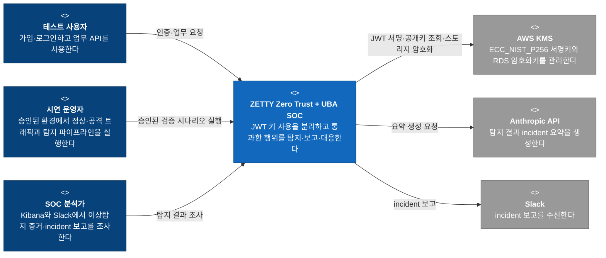
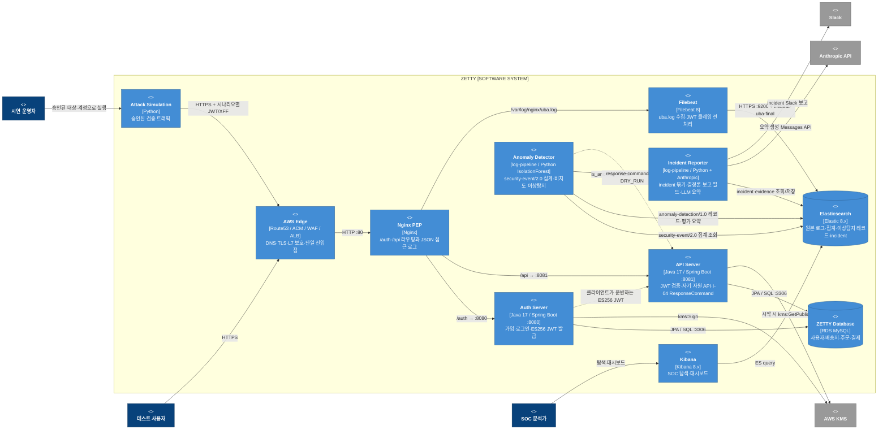
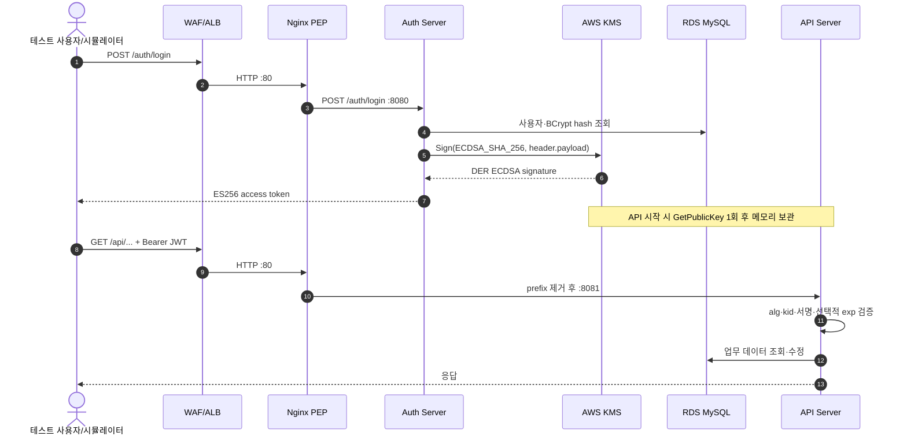
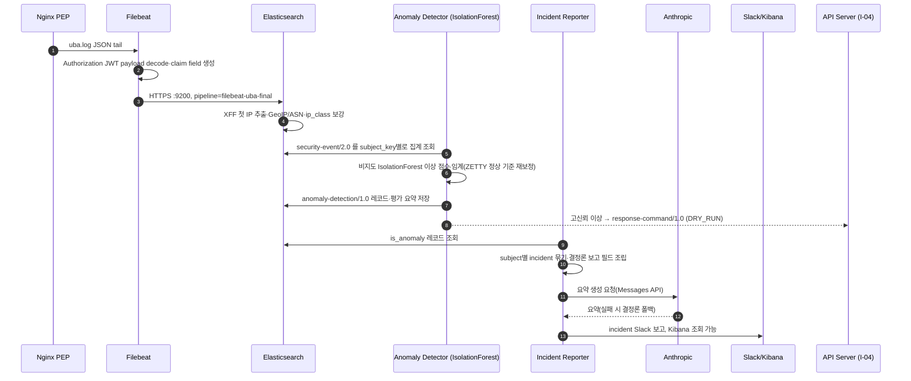
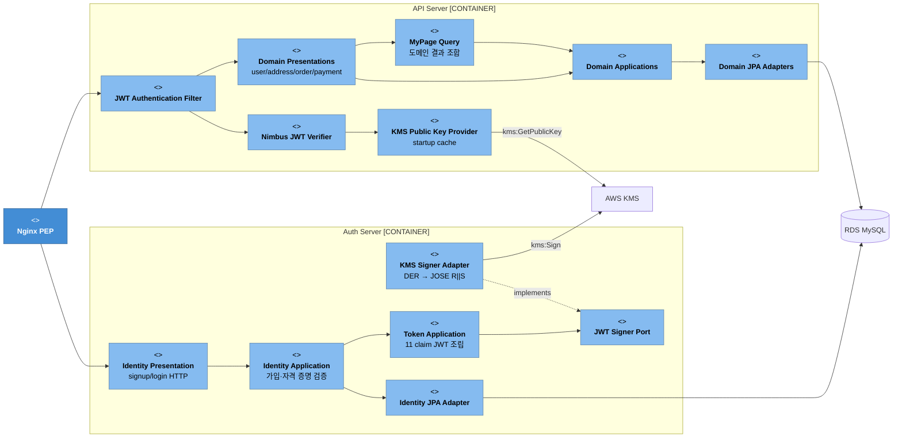
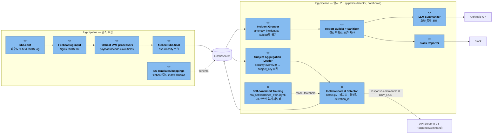
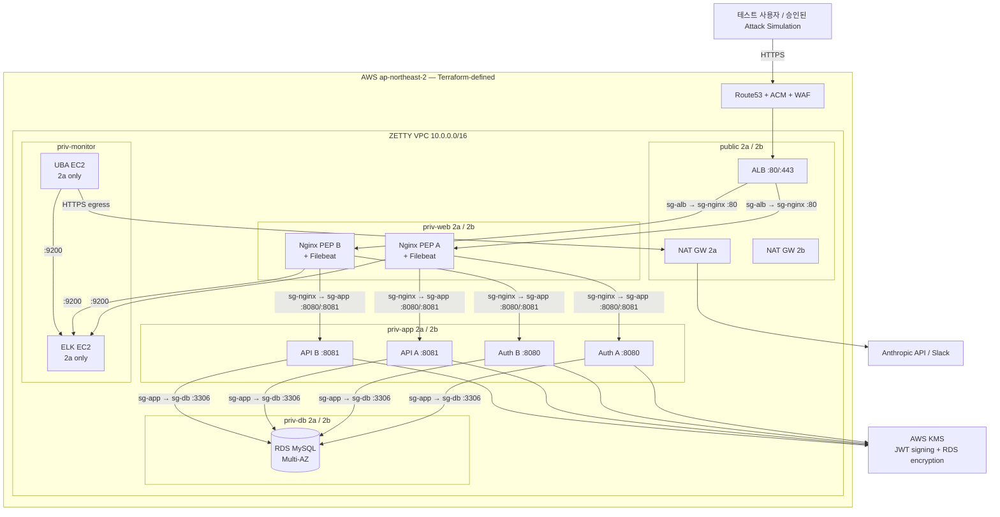

# ZETTY 전체 시스템 — AS-IS C4 Architecture

> 상태: 네 개 활성 저장소(backend·log-pipeline·attack-simulation·zero-trust-architecture, 모두 `develop`이 최종)와 조직 프로필 `.github`의 현재 코드·설정·매핑·Terraform을 대조한 구조 
> v2 정리: v1 `uba-analyzer`(7-factor 스코어링 + LLM ReAct + Elasticsearch 런타임)는 폐기되었고, v2 탐지 본체는 `log-pipeline`이 소유한다 — 서비스 이벤트 IsolationForest 탐지(`pipeline/detector/detect.py`), incident 묶기·LLM 보고(`pipeline/detector/anomaly_incident.py`), self-contained 학습 노트북(`notebooks/rba_selfcontained_train.ipynb`). 대응 집행은 backend의 I-04 ResponseCommand다. 
> 주의: AWS·Elasticsearch·Slack의 현재 운영 상태를 조회한 문서가 아니다. Deployment View는 Terraform이 **정의한 토폴로지**이며 live 배포 확인 결과가 아니다.

## 1. 범위와 읽는 법

이 문서의 Software System 경계는 `backend` 하나가 아니라 **ZETTY Zero Trust + UBA SOC PoC 전체**다. ZETTY는 AWS KMS ES256으로 JWT 서명키 노출 면을 줄이고, 정상 토큰이나 의도된 취약점을 통과한 행위를 Nginx·Filebeat·Elasticsearch·비지도 IsolationForest 이상탐지·LLM 보고로 탐지·정리해 SOC 분석가에게 알리는 시스템이다.

핵심 범위는 다음과 같다.

- 선제 통제: Auth Server만 KMS 서명을 소유하고 API Server는 공개키로 ES256 JWT를 검증한다.
- 사후 탐지: 모든 요청을 Nginx JSON 로그로 남기고, log-pipeline이 `security-event/2.0` 이벤트를 subject_key별로 집계해 비지도 IsolationForest로 이상 점수를 계산한다(`anomaly-detection/1.0`). 학습은 라벨 없이 하고 시간분할로 나누며, 라벨은 평가(ground truth)에만 쓰고 임계는 ZETTY 정상 기준으로 재보정한다.
- LLM 보고: LLM은 공격 판정자가 아니라 탐지 결과·근거를 정리하는 분석 보조다. 결정론적 보고 필드를 조립하고 요약만 LLM이 쓰며, LLM이 없거나 실패해도 결정론 폴백으로 보고가 나간다. `anomaly_score`는 공격 확률이 아니고 evidence는 관측 대 기준 비교일 뿐 인과가 아니다.
- 대응 집행: 고신뢰 이상은 `response-command/1.0`(DRY_RUN 정책 산출물)로 이어지고, 실제 집행은 backend의 I-04 ResponseCommand가 내부 수신·재검증·멱등으로 처리한다. UBA에서 Nginx로 되돌아가는 인라인 자동 차단은 범위 밖이다.
- 검증: 승인된 ZETTY 테스트 환경의 시나리오로 탐지 성능을 확인한다.

### 저장소와 C4 요소의 관계

Git 저장소는 소스 소유 단위이고 C4 Container는 실행·데이터 단위다. 따라서 “저장소 하나 = Container 하나”로 그리지 않는다.

| 저장소 | 현재 소유 책임 | C4에서의 위치 |
|---|---|---|
| `.github/` | 조직 소개, 전체 목적과 저장소 간 계약 | 문서·거버넌스. 런타임 Container 아님 |
| `zero-trust-architecture/` | VPC, SG, ALB/WAF, EC2, RDS, KMS Terraform | Deployment 정의. 런타임 자원을 생성하는 코드 |
| `backend/` | Auth Server, API Server, I-04 ResponseCommand 대응 수신 | 업무·인증·대응집행 Container |
| `log-pipeline/` | Nginx PEP, Filebeat, Elasticsearch ingest·mapping, **v2 이상탐지**(IsolationForest 탐지·incident 보고·학습 노트북) | 진입점·Telemetry·탐지 Container와 데이터 계약 |
| `attack-simulation/` | 승인된 검증 트래픽과 시연 자동화 | 승인된 검증 트래픽 Container |

## 2. Level 1 — System Context

이 다이어그램은 ZETTY 전체가 누구에게 어떤 가치를 제공하고 어떤 외부 시스템에 의존하는지 보여준다.

Context에서 AWS VPC, Nginx, Spring Boot, Elasticsearch 같은 요소가 보이지 않는 이유는 모두 ZETTY 내부 Container 또는 Deployment Node이기 때문이다. `attack-simulation`도 외부 공격자가 아니라 이 PoC가 소유한 승인된 검증 도구다.

## 3. Level 2 — Container

### 전체 런타임과 데이터 흐름

### Container 책임과 소유 저장소

| Container | 소유 저장소 | 입력 | 출력·책임 |
|---|---|---|---|
| Attack Simulation | `attack-simulation` | 운영자가 승인한 대상·시나리오·테스트 자산 | 정상 토큰 재사용 또는 ES256 위조 요청, 로컬 결과 |
| AWS Edge | `zero-trust-architecture` | 인터넷 HTTPS | WAF 평가, TLS 종료, Nginx target group 전달 |
| Nginx PEP | `log-pipeline` | `/auth/*`, `/api/*` | Auth/API 프록시와 `uba_log` JSON 기록 |
| Filebeat | `log-pipeline` | Nginx `uba.log` | JWT claim 전처리 후 `filebeat-*` 색인 요청 |
| Auth Server | `backend` | signup/login | 사용자 저장, ES256 JWT 조립, KMS ECDSA 서명 |
| API Server | `backend` | Bearer JWT와 업무 요청, I-04 ResponseCommand | Nimbus 로컬 서명 검증, 자기 자원 응답, 대응 명령 재검증·멱등 집행 |
| ZETTY Database | `zero-trust-architecture`가 RDS 배포, `backend`가 schema 사용 | Auth/API JPA | 관계형 업무 데이터 |
| Elasticsearch | `log-pipeline`이 ingest·mapping·탐지 문서 소유 | Filebeat와 탐지기 쓰기 | 원본 관측·집계·이상탐지 레코드·incident 저장 |
| Kibana | `log-pipeline`이 dashboard 자산 소유 | Elasticsearch 문서 | 분석가용 탐색·시각화 |
| Anomaly Detector | `log-pipeline` (`pipeline/detector/detect.py`) | `security-event/2.0` subject_key 집계 | 비지도 IsolationForest 이상탐지, `anomaly-detection/1.0` 레코드·평가 요약·`response-command/1.0`(DRY_RUN) |
| Incident Reporter | `log-pipeline` (`pipeline/detector/anomaly_incident.py`) | `is_anomaly` 레코드 | subject별 incident 묶기, 결정론 보고 필드, LLM 요약(폴백 포함), Slack 보고 |

## 4. 주요 런타임 시퀀스

### JWT 발급과 업무 요청

Auth와 API 사이에 직접 런타임 호출은 없다. 협력 계약은 클라이언트가 운반하는 JWT와 공유 데이터 schema다. collection·프로필 API는 JWT `sub`로 사용자 범위를 정하고, 객체 ID 기반 수정·상세 조회는 repository query에서 소유자 ID를 함께 검증한다.

### 로그 수집부터 SOC 알림까지

이상 점수·임계·evidence의 결정권은 log-pipeline의 Python 탐지 계층에 있다. LLM은 판정을 바꾸지 않고 요약만 쓰며, `anomaly_score`는 공격 확률이 아니다. 자동 대응은 정책 코드(`response-command`/I-04)가 결정하고 Incident Reporter는 그 결과만 옮긴다. 학습은 라벨 없이 수행하고 라벨은 평가에만 쓴다.

## 5. Level 3 — 핵심 Component

모든 Container를 클래스 수준까지 펼치지 않고, 저장소 간 계약을 이해하는 데 필요한 부분만 표시한다.

### Backend — 인증·업무 API

### Log Pipeline — 관측·탐지·보고

## 6. Deployment View — Terraform이 정의한 AWS 토폴로지

아래는 `zero-trust-architecture/terraform`의 코드 정의다. 실제 AWS 리소스의 현재 존재·버전·상태를 확인한 결과로 읽으면 안 된다. 이 Terraform은 기존 콘솔 자원을 먼저 import해야 하는 local-state PoC다.

현재 토폴로지 정의는 Edge·App·RDS를 두 AZ에 걸치지만 ELK와 UBA는 `priv-monitor-2a` 단일 EC2다. 따라서 전체 탐지 경로가 Multi-AZ라고 표현할 수는 없다.

## 7. 저장소 간 계약

| 계약 | Producer | Consumer | 현재 형식·소유 기준 |
|---|---|---|---|
| HTTP path | `backend` | Nginx, attack scenarios, UBA endpoint sensitivity | `/auth/*`, `/api/*`; Nginx가 `/api/` prefix 제거 후 API에 전달 |
| JWT header·claim | Auth Server | API Server, Filebeat, UBA, attack simulation | ES256, `kid`, 순차 정수 `sub`, `jti`, `iat`, `exp`, `iss`, `aud`, `acr`, `amr`, `ext.*` |
| JWT key use | Auth Server | AWS KMS | `kms:Sign`, ECDSA SHA-256, DER→JOSE 변환 |
| JWT verify key | AWS KMS | API Server | `kms:GetPublicKey`; 애플리케이션 시작 시 메모리 적재 |
| Access log | Nginx PEP | Filebeat | `uba_log` JSON 9 fields, `/var/log/nginx/uba.log` |
| Normalized telemetry | Filebeat + ES ingest | UBA | `filebeat-*`, JWT fields, XFF 첫 client IP, GeoIP/ASN, `ip_class` |
| Deterministic detection | log-pipeline `pipeline/detector/detect.py` | Incident Reporter, Kibana, 평가 | `anomaly-detection/1.0` 레코드(결정적 detection_id/input_hash)·평가 요약·`response-command/1.0`(DRY_RUN) |
| Incident report | log-pipeline `pipeline/detector/anomaly_incident.py` | Slack, Kibana | subject별 incident, 결정론 보고 필드, LLM 요약(폴백); `anomaly_score`는 공격 확률 아님 |
| Response command | log-pipeline detector | `backend` I-04 ResponseCommand | `response-command/1.0`; 내부 수신·재검증·멱등 집행, DRY_RUN 기본 |
| Scenario expectation | `attack-simulation` 시나리오 문서 | 탐지 평가 | 승인된 시나리오 ID와 기대 신호(평가용 라벨) |
| Measured result | log-pipeline 탐지 평가 요약 | 발표·면접·회귀 판단 | 시간분할 평가 지표. 목표값과 실제 결과를 구분 |

## 8. 현재 확인된 정합성 차이와 위험

이 표는 C4를 실제 실행 계약에 맞추며 확인한 차이다. 문서의 목표값을 현재 동작으로 단정하지 않는다.

| 항목 | 현재 확인된 사실 | 영향 |
|---|---|---|
| 프로젝트 명칭 | 저장소 문서와 리소스에 `ZETI`와 `ZETTY`가 혼재한다 | 검색·index·alias·발표 용어가 분산된다. 물리 식별자는 무계획 일괄 변경하면 안 된다 |
| API KMS 권한 | API 코드가 호출하는 것은 `GetPublicKey`뿐이나 Terraform KMS policy에는 `Verify`도 허용된다 | 의도한 최소 권한 설명과 IaC가 다르다 |
| 공개키 갱신 | API는 시작 시 한 번 공개키를 읽고 TTL·refresh·다중 `kid` 회전을 구현하지 않는다 | 키 회전 시 재시작·호환 순서가 명시돼야 한다 |
| Filebeat 입력 | Nginx는 `uba.log`를 쓰지만 일반 `filebeat.yml`은 `access.log`, 배포용 설정은 `uba.log`를 읽는다 | 어떤 설정이 canonical인지 불명확하다 |
| Filebeat 전송 | 실제 배포용 설정은 Elasticsearch HTTPS `:9200` direct output이다. 일부 README/SG 설명에는 Beats `:5044` 흐름이 남아 있다 | 운영 점검 시 포트와 장애 지점을 잘못 추적할 수 있다 |
| JWT decode 위치 | 현재 JWT 필드 생성은 Filebeat processors가 담당하고 `filebeat-uba-final` ingest는 `asn-classify`를 호출한다 | “ES ingest에서 JWT decode”라는 문서와 실제 producer가 다르다 |
| 탐지 스케줄 | v2 탐지는 집계 조회 → IsolationForest → incident 묶기의 배치 실행이며 실행 주기·트리거는 배포 설정에 따라 확정한다 | MTTD와 비용 추정의 기준 주기를 배포 설정으로 명시해야 한다 |
| Scenario 기대값 | attack-simulation 시나리오의 기대 신호는 평가(ground truth)용 라벨이며 비지도 IsolationForest 학습 입력이 아니다 | 시나리오 기대값과 시간분할 평가 결과를 구현 완료로 혼동하면 안 된다 |
| Terraform 적용성 | 콘솔 자원 import가 선행돼야 하며 ALB와 Route53 모듈이 서로의 output을 참조한다 | live 상태·`plan`·`apply` 성공을 검증 전 단정할 수 없다 |
| Monitor 가용성 | ELK·UBA는 2a 단일 인스턴스로 정의되어 있다 | 탐지·알림 경로에는 단일 장애점이 있다. PoC 수용 여부를 명시해야 한다 |
| Secret 경계 | 일부 배포 설정은 credential 외부화가 일관되지 않다 | 문서·Git·로그에 secret이 노출되지 않도록 설정 경계를 정리해야 한다 |

## 9. 보존되는 실험·안전 경계

- 순차 정수 `User.id`·JWT `sub`, `door_password` 평문 응답, MOCK OTP와 문서화된 키 유출 재현 자산은 실험 계약이다. 자원 API의 소유권 검사는 실험 profile에서도 유지한다.
- 의도된 취약점을 운영상 결함처럼 임의 수정하거나 범위를 넓히지 않는다.
- 공격 시나리오는 사용자 소유·승인 ZETTY 테스트 인프라에만 실행한다.
- 탐지 결과는 `response-command/1.0`으로 backend I-04 ResponseCommand에 전달되어 내부 수신·재검증·멱등으로 집행된다. DRY_RUN이 기본이며 UBA가 Nginx로 되돌아가 요청을 인라인 자동 차단하는 경로는 없다.
- LLM은 이상 점수·임계·evidence를 덮어쓰지 않고 요약만 쓴다. `anomaly_score`는 공격 확률이 아니며, 원문 토큰·개인정보는 탐지 입력 단계의 새니타이즈로 차단한다.
- Terraform apply/destroy/import, Elasticsearch mapping reset, Nginx reload, SSM deploy는 이 문서 작성 범위에서 실행하거나 검증하지 않았다.

## 10. 근거 문서와 코드

우선순위는 전체 계약 → 저장소 책임 문서 → 실제 코드·설정·mapping → 탐지 평가 순이다.

- 전체 목적·계약: `.github/profile/README.md`
- 인프라 정의: `zero-trust-architecture/README.md`, `zero-trust-architecture/terraform/`
- 인증·업무 API·대응: `backend/README.md`, `auth-server/src/`, `api-server/src/`
- 로그·ES 계약: `log-pipeline/README.md`, `nginx-pep/uba.conf`, `filebeat/`, `es-pipelines/`, `es-mappings/`
- 탐지·보고: `log-pipeline/pipeline/detector/detect.py`, `pipeline/detector/anomaly_incident.py`, `notebooks/rba_selfcontained_train.ipynb`
- 공격 기대값: `attack-simulation/README.md`와 시나리오 문서

목표 구조와 단계별 정합화는 [TO-BE C4 Architecture](./c4-to-be.md)에서 설명한다.
