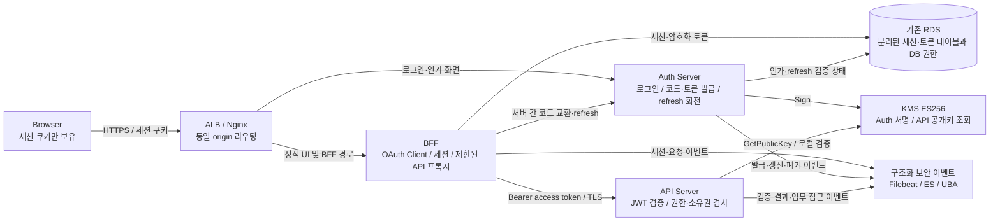

# 인증·인가와 토큰 저장 아키텍처

> 작성: 2026-09-06 · 클라이언트: 사용자 확인으로 웹 확정. BFF는 설계 제안이며 미구현·미배포.
> 현재 구현 설명은 [AS-IS](./C4-as-is.md), 기존 전체 설계는 [C4 TO-BE](./c4-to-be.md) 참고.
> 이번 제안은 웹의 토큰 저장·수명·인가·관측 경계를 다룬다. 의도된 IDOR의 처리 방식은 미확정이다.

## 1. 결정과 근거

웹 기본안은 **BFF(Backend for Frontend)에 access token과 refresh token을 저장하고, 브라우저에는 불투명한 세션 ID 쿠키만 전달**하는 구조다. BFF는 브라우저 요청을 받아 사용자 토큰으로 API를 호출하는 서버다. 사용자 요청을 고려한 ZETTY 설계 선택이며 모든 JWT 서비스에 필수인 구조라는 뜻은 아니다.

브라우저용 OAuth의 공식 기준인 [RFC 10017 §6](https://www.rfc-editor.org/rfc/rfc10017.html#section-6)은 BFF, token-mediating backend, 브라우저 OAuth client를 구분한다. BFF는 토큰의 브라우저 노출을 줄이지만 XSS가 사용자 브라우저에서 요청을 실행하는 것까지 막지는 못한다. 쿠키 보호·CSRF 방어·프록시 목적지 제한은 별도로 필요하다. 이 자료는 2026년 8월 발행된 BCP이며 초안이 아니다.

| 대안 | Access token 사용 사본 | Refresh token 사용 사본 | 판단 |
|---|---|---|---|
| BFF — 기본안 | BFF 서버 | BFF 서버 | 브라우저 토큰 노출 축소. 프록시와 서버 세션 운영 비용 발생 |
| Token-mediating backend | 브라우저 메모리 | 중개 서버 | 직접 API 호출에 유리하지만 JS가 access token을 취급 |
| 자체 refresh-cookie 방식 | 브라우저 메모리 | HttpOnly 쿠키 | 별도 선택지. refresh CSRF·회전·쿠키 범위와 API CORS 설계 필요 |
| 브라우저 영속 저장 | localStorage / IndexedDB 등 | 같은 저장소 | 이 프로젝트의 기본안에서 제외. XSS에 의한 읽기와 탈취 후 재사용 위험 |

`sessionStorage`도 JavaScript에서 읽을 수 있어 HttpOnly와 같은 보호가 아니다. [OWASP HTML5 Security](https://cheatsheetseries.owasp.org/cheatsheets/HTML5_Security_Cheat_Sheet.html#local-storage)와 [Session Management](https://cheatsheetseries.owasp.org/cheatsheets/Session_Management_Cheat_Sheet.html#httponly-attribute)를 따른다.

## 2. 목표 구조와 서비스 책임

- `backend/bff-server`를 작은 실행 모듈로 추가하는 제안이다. 아직 디렉터리나 배포 자원을 만들지 않았다. 별도 저장소·Kafka·Redis는 전제하지 않는다. 추가 프로세스와 요청 홉이 비용이다.
- BFF는 Spring Security OAuth2 Client, Auth는 Spring Authorization Server 기반 Authorization Code + PKCE(S256) 및 OIDC 로그인, API는 Spring Security Resource Server + Nimbus 검증을 사용한다. 현재 `/auth/login` JSON 발급기는 이 프로토콜을 구현한 서버가 아니므로 실제 전환 작업이 필요하다.
- BFF는 등록된 confidential client로 서버 간 인증한다. 인증 수단·자격증명은 외부 설정과 workload별 secret 경계에 둔다. JWT 서명 권한을 BFF에 공유하지 않는다.
- API의 자원 소유권과 scope 검사는 BFF 통과 여부와 무관하게 수행한다. BFF는 사용자 JWT를 전달하며 여러 사용자를 공용 서비스 토큰 하나로 대체하지 않는다.
- 웹의 공개 업무 경로는 BFF로 향한다. 외부 `/api` 직접 경로를 유지할지는 모바일·승인된 시뮬레이션 요구로 별도 결정한다. 공개 로그인·인가 경로와 서버용 token/revocation 경로도 구분한다.
- 서버 간·프록시 구간에도 TLS를 적용하고 인증서·호스트명을 검증하는 목표다. 현재 Nginx의 HTTP upstream과 다르며 Terraform·배포 변경이 필요하다. 구체적인 호스트·포트·SG 변경은 구현 단계에서 확정한다.

구현 근거: [Spring OAuth2 Client](https://docs.spring.io/spring-security/reference/6.5/servlet/oauth2/client/core.html), [Spring Authorization Server](https://docs.spring.io/spring-authorization-server/reference/overview.html), [Spring Resource Server](https://docs.spring.io/spring-security/reference/6.5/servlet/oauth2/resource-server/jwt.html). 설치 시 Boot BOM과 실제 의존성 버전을 확인하며 문서 예제의 최신 버전으로 일괄 업그레이드하지 않는다.

## 3. 정확히 어디에 무엇을 저장하는가

다음은 ZETTY의 제안이다. 라이브러리 기본 설정이 아래 보관·암호화 정책을 자동 제공한다고 가정하지 않는다.

| 주체 / 저장소 | 저장 값 | 수명·보호 |
|---|---|---|
| 브라우저 쿠키 저장소 | 고엔트로피 세션 ID | `__Host-zetty-session`; Secure, HttpOnly, Path=/, Domain 없음, SameSite=Lax |
| 브라우저 JS·Web Storage | 사용자 표시 정보와 CSRF 토큰만 | access/refresh token 저장·응답 금지. CSRF 토큰은 인증 세션 ID와 다른 값 |
| BFF 세션 저장소 — RDS / Spring Session JDBC | 인증 상태, principal, authorized-client 레코드 참조, CSRF 상태, 만료·폐기 상태 | 원문 OAuth 토큰은 세션 attribute에 직렬화하지 않음. 로그인 성공 시 세션 ID 교체 |
| BFF authorized-client 저장소 — RDS 별도 테이블 | 사용 가능한 access/refresh token의 **복호화 가능한 암호문**, 만료 시각, client·session 연결, 암호화 키 버전 | BFF 전용 DB 권한. 토큰을 Auth/API에 제출해야 하므로 해시만으로는 동작 불가 |
| Auth 인가 저장소 — RDS 별도 테이블 | refresh token의 **검증용 해시**, family·generation·user·client·scope·audience·만료·폐기·사용 상태 | 제안 refresh token은 충분히 긴 난수 opaque 값. 원문 재보관 없이 제시된 값의 해시를 조회 |
| API | 신뢰한 공개키와 해당 요청의 검증 결과 | refresh token을 받거나 저장하지 않음. 일반 요청마다 access token을 DB에 보관하지 않음 |
| ES·로그·LLM·Slack | 비밀이 아닌 상관 식별자와 검증 결과 | 원문 access/refresh token, Cookie, Authorization, 코드·PKCE verifier를 저장하지 않음 |

**BFF의 복호화 가능한 토큰과 Auth의 검증용 해시는 목적이 다르다.** BFF는 OAuth client로서 토큰 원문을 재제출하고, Auth는 발급자로서 제출된 토큰의 유효성을 판정한다.

기존 RDS를 사용하되 BFF 세션·토큰, Auth 인가, 업무 데이터의 DB 계정과 테이블 접근 권한을 분리한다. [Spring Session JDBC](https://docs.spring.io/spring-session/reference/3.5/configuration/jdbc.html)는 세션을 DB에 보관할 수 있지만 token vault 암호화나 refresh 회전을 구현해주는 기능은 아니다. Spring OAuth 저장 어댑터도 실제 구현을 확인하고 위 정책에 맞춘 persistence adapter를 작성해야 한다.

토큰 vault는 검증된 AEAD 구현과 envelope encryption을 사용하도록 설계한다. 복호화 권한은 BFF만 소유하고 키는 DB·소스와 분리한다. 필요한 경우 별도 대칭 KMS 키를 사용하며 **JWT용 ES256 SIGN_VERIFY 키를 암호화에 사용하지 않는다**. RDS 저장장치 암호화만으로 DB 조회 권한 탈취를 방어한다고 보지 않는다. 암호문도 로그·dump·Git 산출물에서 제외한다. 키 생성·IAM 확대는 이 문서 작성으로 실행되지 않는다.

## 4. 로그인·요청·갱신·종료 흐름

### 로그인과 요청

1. UI와 BFF를 동일 HTTPS origin으로 제공한다. BFF는 서버 측 로그인 트랜잭션에 state·nonce·PKCE verifier와 만료를 저장한다.
2. 브라우저를 Auth 인가 화면으로 redirect한다. 정확히 등록한 callback만 허용한다. Auth 로그인 세션 쿠키는 BFF 세션과 별개로 관리한다.
3. callback에서 state·로그인 트랜잭션을 검증하고 BFF가 서버 간 code를 교환한다. OIDC issuer·audience·nonce 등을 검증하며 ID token을 API access token으로 사용하지 않는다.
4. BFF가 세션 ID를 교체하고 OAuth 토큰을 vault에 저장한다. callback 후 query 없는 URL로 redirect한다. edge/BFF/APM에 code·state 쿼리를 기록하지 않도록 한다.
5. 브라우저는 세션 쿠키로 `/bff/...`를 호출한다. BFF는 세션 유효성·CSRF를 검사하고 정해진 API에만 access token을 붙인다. 클라이언트가 보낸 Authorization·내부 신원 헤더를 제거하며 브라우저 Cookie를 API에 전달하지 않는다.
6. API는 서명·허용 ES256·신뢰한 kid·필수 exp/iss/aud/sub·시간 조건과 scope·소유권을 검증한다. 인증 실패는 401, 인증 후 권한 부족은 403을 기본 계약으로 한다.

`SameSite=Lax`는 외부 인가 서버에서 돌아오는 top-level GET callback과 세션 연결을 고려한 초기 선택이다. Strict로 강화하려면 로그인 트랜잭션 쿠키를 분리하고 실제 redirect 흐름을 검증한다. POST callback(`form_post`)은 이 가정에 포함되지 않는다. CSRF 방어는 별도로 유지한다.

### 갱신과 동시성

- access token 만료가 가까우면 BFF가 refresh한다. 브라우저 JS가 refresh token을 취급하지 않는다.
- Auth는 client 인증·인가 범위·만료·폐기 상태를 검증한 뒤 원자적 상태 전이로 이전 refresh token을 사용 처리하고 새 값을 한 번 발급한다. 회전해도 family의 절대 만료 시각을 늘리지 않는다.
- 여러 BFF 인스턴스의 동시 갱신은 세션별 DB lease/version 등으로 하나만 수행하고, 다른 요청은 저장된 새 버전을 읽는다. 프로세스 내부 lock만으로 충분하지 않다.
- 이미 소비된 refresh token의 재사용은 family 폐기·보안 이벤트로 처리한다. 정상 요청의 중복 갱신을 재사용 공격으로 오인하지 않도록 동시성 테스트가 필요하다.
- 응답 유실로 갱신 성공 여부가 불명확하면 사용했을 수 있는 이전 refresh token을 자동 재전송하지 않는다. 해당 세션 재로그인을 요구하는 실패 정책을 기본안으로 둔다.
- API 401을 이유로 결제·수정 요청을 무조건 재전송하지 않는다. 재시도는 인증 실패가 업무 실행 전에 확정된 경우 또는 명시적인 idempotency 계약이 있는 경우에만 허용한다.

refresh 보호와 회전의 근거는 [RFC 9700 §4.14](https://www.rfc-editor.org/rfc/rfc9700.html#section-4.14)다. confidential BFF에서의 회전·DB 동시성·실패 처리는 이 프로젝트의 추가 정책이다. 프레임워크의 `reuseRefreshTokens(false)` 같은 옵션만으로 family 재사용 탐지 전체가 완성됐다고 간주하지 않는다.

### 로그아웃·만료·장애

| 항목 | 초기 제안값 / 동작 | 비고 |
|---|---|---|
| Access token | 최대 10분 | 기존 TTL 600초를 기준으로 시작. 필수 exp와 최대 수명 검사 |
| BFF 세션 | idle 30분, absolute 8시간 | 모든 값은 외부 설정. 요청·refresh가 절대 만료를 연장하지 않음 |
| Refresh family | absolute 8시간 이하 | BFF 세션보다 긴 로그인 유지 기능은 초기 범위에 없음 |
| 현재 기기 로그아웃 | CSRF 보호 POST → 로컬 세션 폐기·vault 제거·Auth family 폐기 → 쿠키 만료 | Auth 호출 실패 시 비밀 원문이 없는 폐기 작업을 안전하게 재시도할 내부 수단 필요 |
| 전체 기기 로그아웃 | 사용자 세션·family 일괄 폐기 | 로컬 로그아웃과 구분. Auth SSO 세션 종료 여부도 별도 정의 |
| DB/vault 장애 | 보호 API 요청 거부, 운영 오류로 보고 | 캐시된 인증 상태로 무기한 통과시키지 않음 |

로그아웃 즉시 BFF 경로의 새 요청은 거부한다. 이미 진행 중인 요청이나 탈취된 JWT의 직접 API 재사용까지 소급 취소한다고 보장하지 않는다. 초기안은 access token 만료(+설정된 clock skew)까지의 잔여 유효성을 수용한다. 즉시 API 폐기가 요구되면 세션 상태 조회·introspection 등 검증 계약을 추가해야 한다. 이 선택은 JWT가 stateless라는 설명만으로 생략할 수 없다.

[AWS KMS 공식 문서](https://docs.aws.amazon.com/kms/latest/developerguide/offline-public-key.html)에 따라 KMS 키 비활성화만으로 API의 캐시 공개키 검증이 멈추지 않는다. 키 신뢰 철회와 토큰·세션 폐기는 별개다.

## 5. 쿠키·CSRF·프록시 보안

- BFF 세션 체인은 stateful이며 Spring CSRF 보호를 유지한다. 상태 변경 요청은 세션에 연결된 CSRF 토큰을 헤더로 검증하고 허용 Origin/Referer도 확인한다. CSRF 토큰을 UI가 읽을 수 있다는 사실이 HttpOnly 인증 쿠키를 읽게 한다는 뜻은 아니다.
- CORS는 기본적으로 동일 origin만 허용한다. 인증 쿠키를 포함하는 요청에 임의 origin 반사나 wildcard 허용을 사용하지 않는다. SameSite는 origin과 동일한 개념이 아니므로 단독 보호로 가정하지 않는다.
- 브라우저 자격증명을 받지 않는 API Bearer 체인과 BFF 쿠키 체인의 CSRF 정책을 분리한다. 애플리케이션 전체에 무조건 `csrf.disable()`을 적용하지 않는다. [Spring CSRF](https://docs.spring.io/spring-security/reference/6.5/features/exploits/csrf.html#csrf-and-stateless-browser-applications)
- BFF의 API 목적지·경로·HTTP method를 allowlist로 정한다. 사용자 입력 URL로 프록시하지 않고 외부 redirect에 Authorization이 전달되지 않게 한다.
- 세션·인증 응답은 `Cache-Control: no-store`; 사용자별 API 응답을 공유 캐시에 섞지 않는다. 쿠키 로그·APM body 수집·에러 dump를 통제한다.
- HttpOnly/BFF도 XSS의 사용자 권한 요청 실행을 막지는 못한다. 출력 인코딩·CSP·의존성 관리·민감 작업의 재인증을 별도 적용한다.

## 6. ZETTY 로그·UBA·실험 계약에 미치는 영향

현재 [Nginx uba.conf](../../log-pipeline/nginx-pep/uba.conf)는 `$http_authorization` 원문을 `jwt` 필드에 기록한다. [Filebeat processor](../../log-pipeline/filebeat/filebeat-processors-jwt.yml)는 그 문자열을 분해하고 [UBA log_fetcher](../../uba-analyzer/ingest/log_fetcher.py)는 `jwt.sub/jti/ext.LSID` 등을 읽는다. 설정 확인 결과이며 현재 배포 상태를 의미하지 않는다.

BFF를 넣으면 외부 Nginx에는 세션 쿠키가 오므로 JWT가 없어진다. 또한 API의 연결 IP는 BFF가 된다. **토큰을 안전하게 보관하는 변경이 탐지 입력을 없애거나 모든 사용자를 한 IP로 합칠 수 있다.** 다음 telemetry 전환이 BFF 운영 전 완료 조건이다.

1. API 인증·인가 경계에서 허용한 필드만 구조화 이벤트로 기록한다: 검증 결과, 검증된 sub/jti/issuer/audience·수명·세션 상관 ID, method, 정규화된 경로, status, 응답량, 요청 식별자. 서명 포함 원문 JWT는 기록하지 않는다.
2. 로그인·refresh·logout·거부는 Auth/BFF 보안 이벤트로 추가한다. 세션 상관 ID는 인증 쿠키 값과 다른 비밀 아닌 식별자이며 기존 `ext.LSID` 의미와 연결 규칙을 정의한다. 갱신 때 jti는 바꾸고 동일 로그인 세션의 LSID는 유지하는 목표다.
3. 서명 미검증 claim은 검증된 사용자 정보와 분리한다. 실패 이유만으로 필요한 신호를 남기고 토큰 원문·임의 payload 전체를 보존하지 않는다.
4. 일반 웹 트래픽은 신뢰하는 ALB/Nginx hop에서 클라이언트 IP를 산출하고 외부에서 주입된 XFF·내부 identity 헤더를 신뢰하지 않는다. BFF는 검증된 전달 메타데이터만 재구성하고 API는 신뢰한 BFF 경로에서만 이를 수용한다.
5. 현재의 첫 XFF IP 기반 시뮬레이션 계약을 조용히 바꾸지 않는다. 신규 trusted client IP와 기존 실험 IP 의미를 schema version/provenance로 구분하고, ASN 분류·mapping·UBA 입력·scenario fixture를 함께 전환한다.
6. 기존 필드와 신규 이벤트를 읽는 adapter, strict mapping, 중복 제거용 request/evidence ID와 경로 정규화를 준비한 뒤 raw Authorization 로깅·분해 의존을 제거한다. `Cookie`, `Set-Cookie`, OAuth callback query도 access/error 로그와 APM에서 제외한다.

ML UBA 전환은 사용자가 요청한 후속 목표다. 이 문서에서는 ML 입력이 사용할 신원·시간·행위 데이터 경계만 정한다. 기존 factor 점수를 ML 정답으로 간주하지 않는다. LLM은 설명·grounding을 맡고 UBA에서 자동 차단을 수행하지 않는 경계는 유지한다.

자원 API는 JWT `sub` 기반 자기 자원 경로와 repository-level ownership query를 사용한다. S2/S4/S5/S5b/S6/S8은 path 사용자 ID에 의존하지 않고 탈취·위조 token의 `sub`로 같은 자기 자원 API를 호출한다. 인증 서버의 사용자 로그아웃·프로토콜 재사용 방어는 UBA 자동 차단과 구분한다.

## 7. 전환 순서와 완료 기준

| 순서 | 대상 | 작업·검증 |
|---|---|---|
| 1 | backend | JWT 필수 클레임·scope·소유권·키 신뢰 계약과 401/403/404 테스트 |
| 2 | backend | Auth 코드·refresh·폐기와 BFF 세션/vault 구현. 저장 암호화·해시 lookup·회전 원자성·동시 요청·응답 유실 테스트 |
| 3 | log-pipeline → uba-analyzer | 신규 이벤트 mapping → 구·신 consumer 호환 → backend 이벤트 producer 순으로 준비. raw token 제거와 입력 정합성 검증 |
| 4 | backend + infrastructure + log-pipeline | 동일 origin 라우팅, 내부 TLS·SG·DB 권한, 다중 BFF 세션 공유, client IP 전달, 키 교체·장애 테스트 |
| 5 | 웹 클라이언트 + attack-simulation | 로그인 callback·새로고침·로그아웃·CSRF·XSS 잔여 위험·허용 목적지만 프록시됨을 확인. 실험 시나리오/KPI 재정의 |

최소 인수 조건: 브라우저 저장소와 BFF 응답에 OAuth 토큰 없음; DB 원문 토큰 없음; 두 BFF 인스턴스에서 동일 세션 사용; 동시 갱신 1회; 이전 refresh 재사용 거부; 외부 Origin의 상태 변경 거부; 타인 자원 접근 거부(확정된 정상 모드); 로그·ES·LLM에 credential 없음; 여러 브라우저 IP와 검증된 사용자 식별자가 UBA까지 구분됨.

이 문서는 설계만 변경한다. AWS·DB·ES·Slack 배포와 공격 실행은 수행하지 않았다. 모바일 클라이언트가 추가되면 브라우저 쿠키 모델을 그대로 복제하지 않고 native client의 redirect·PKCE·OS 보안 저장소를 별도 설계한다.
