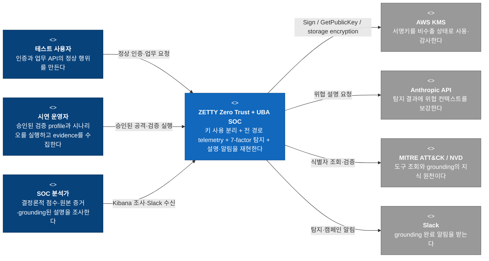
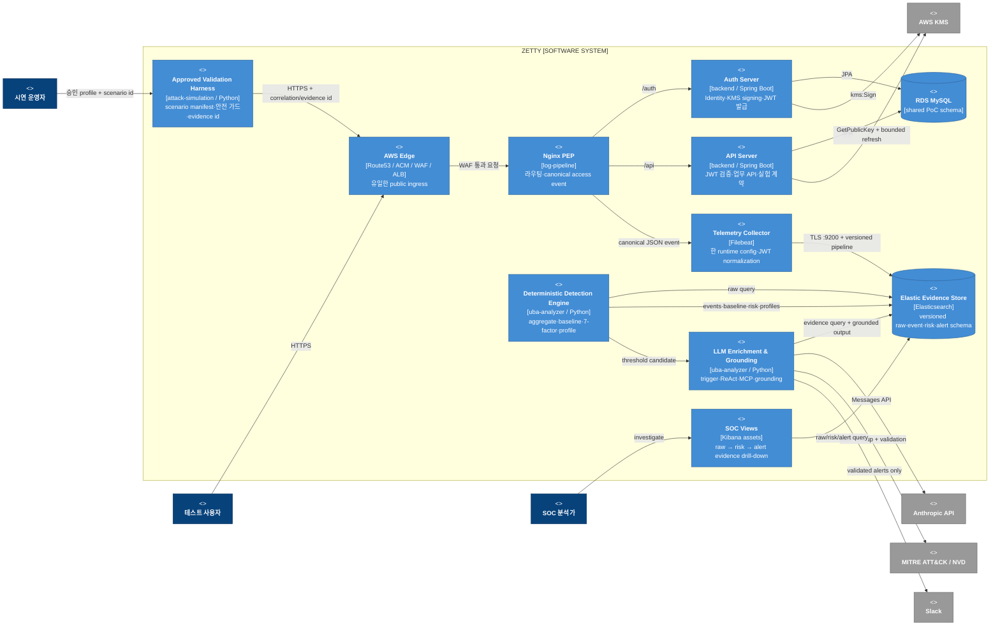
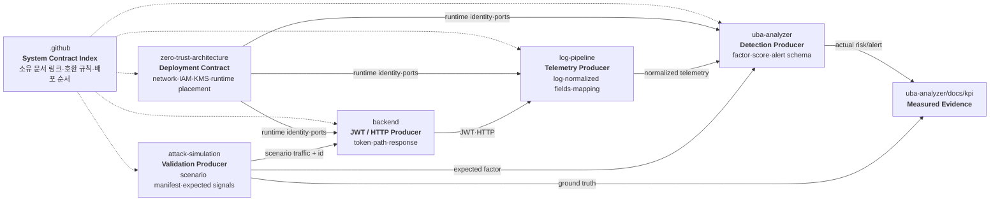
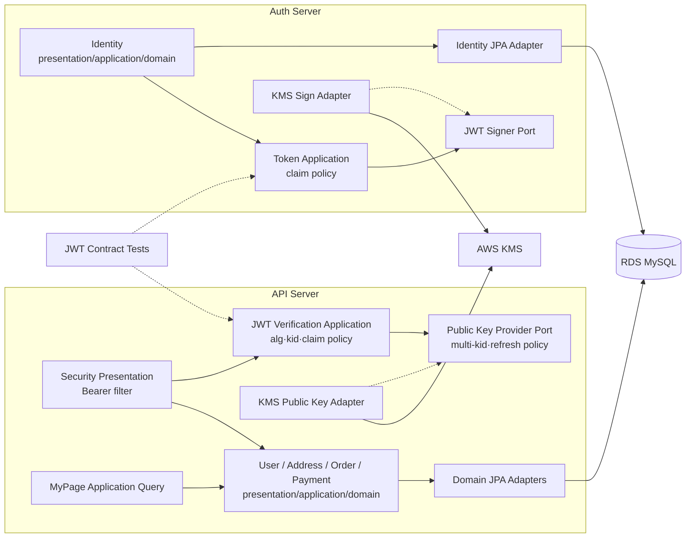
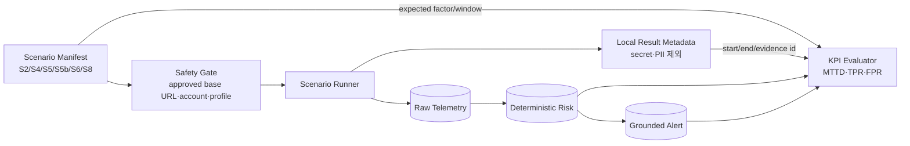
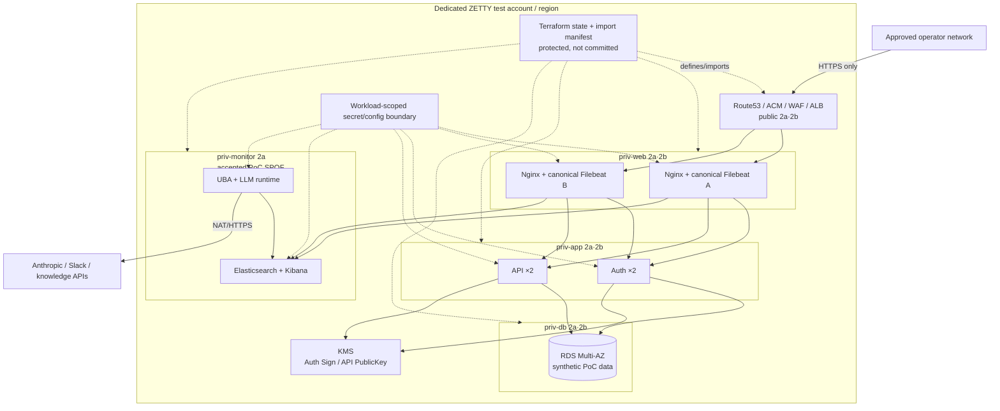

# ZETTY 전체 시스템 — TO-BE C4 Architecture

> **2026-09-06 설계 갱신:** JWT·인증·인가·토큰 저장·세션·BFF·관련 telemetry는
> [인증·인가와 토큰 저장 아키텍처](./auth-token-architecture.md)를 우선한다.
> 아래 C4는 이전 전체 설계 기준선이다. 특히 BFF가 없는 직접 API 경로·배포 그림과
> 운영/실험 분리 제외는 새 설계의 확정 구조가 아니다. 자원 API의 소유권 검사는 공통 기본 계약이다.
> 사용자의 ML 기반 UBA 전환 요청으로 아래의 7-factor 고정·학습 금지 역시 향후 목표의
> 제약으로 적용하지 않는다. ML 상세 설계는 별도 후속 범위이며 현재 구현이 바뀐 것은 아니다.

> 상태: 제안. 아직 모든 저장소에 구현되지 않은 목표 구조 
> 기준: 현재 여섯 저장소의 책임, 의도된 취약점, 탐지·알림 범위, AS-IS 정합성 차이 
> 목표: 새로운 플랫폼을 발명하는 것이 아니라 현재 PoC를 **재현 가능하고 계약이 명확한 하나의 시스템**으로 만든다.

## 1. 목표와 변경하지 않는 경계

TO-BE는 `backend`만 강화하는 설계가 아니다. `attack-simulation → Edge/PEP → backend → log-pipeline → Elasticsearch → UBA → LLM/grounding → Slack/Kibana` 전체 경로를 하나의 검증 가능한 아키텍처로 정리한다.

### Architecture Drivers

| Driver | 목표 상태 |
|---|---|
| 전체 시스템 경계 | 여섯 저장소의 producer·consumer·배포 순서가 하나의 C4와 계약 표에서 추적된다 |
| 재현 가능성 | Terraform, runtime config, mapping, cron, 시나리오가 같은 환경 가정을 공유한다 |
| 키 최소 권한 | Auth만 `kms:Sign`, API는 실제 필요한 공개키 조회만 허용하며 키 회전 계약이 있다 |
| 관측 일관성 | Nginx log path부터 Filebeat processor, ES ingest·mapping, UBA field까지 한 schema로 고정된다 |
| 결정론 보존 | 점수·factor·attacker level은 Python 계층만 소유하고 LLM은 grounding된 설명만 추가한다 |
| 검증 가능성 | 각 시나리오의 입력, 기대 factor, 실제 risk doc, alert, KPI를 한 evidence chain으로 연결한다 |
| 안전성 | 공격은 승인된 테스트 경계에서만 실행하고 secret·key·PII 산출물을 Git에 남기지 않는다 |

### 변경하지 않는 것

- PoC의 종료점은 탐지·알림이다. UBA에서 Nginx나 Backend로 돌아가는 자동 차단 경로를 만들지 않는다.
- 학습·파인튜닝을 추가하지 않는다. LLM은 추론과 컨텍스트 보강만 한다.
- ES256, AWS KMS, Java 17, Spring Boot, Gradle, Nimbus JOSE 경계를 유지한다.
- 순차 `sub`, 민감 응답 fixture, MOCK OTP와 문서화된 키 유출 재현 자산은 별도 요청 없이는 범위를 넓히거나 축소하지 않는다. 자원 소유권 검사는 모든 profile에서 유지한다.
- Kafka, 별도 PDP, MFA SaaS, 마이크로서비스 분해, Identity/Resource DB 분리는 현재 검증 목표에 필요하지 않으므로 전제하지 않는다.
- 단일 ELK·UBA 노드는 PoC의 명시적 제약으로 둘 수 있다. “전체 Multi-AZ”라고 잘못 표현하지만 않으면 된다.

## 2. Level 1 — Target System Context

Context의 외부 관계는 AS-IS와 크게 다르지 않다. TO-BE의 핵심은 새 시스템 추가가 아니라 ZETTY 내부 계약과 검증의 폐쇄형 evidence chain을 완성하는 데 있다.

## 3. Level 2 — Target Container

다이어그램에 `enrich → pep/api` 화살표가 없는 것이 중요하다. 분석 결과는 사람에게 전달되며 정책 집행을 자동 변경하지 않는다.

### AS-IS에서 달라지는 Container 계약

| AS-IS | TO-BE |
|---|---|
| README마다 전체 흐름·포트·스케줄 표현이 다름 | `.github`의 전체 계약과 각 producer 소유 문서를 기준으로 한 단일 계약 표 |
| 일반/배포 Filebeat 설정이 서로 다른 log path를 사용 | 환경별 값만 분리하고 입력·processor·output 의미는 하나인 canonical config |
| JWT decode 위치가 문서와 설정에서 다르게 설명됨 | JWT normalization owner를 Filebeat 또는 ES ingest 중 하나로 결정하고 contract test로 고정 |
| API 공개키가 startup-only cache | 복수 `kid`, 제한된 refresh, 이전 키 허용 기간과 실패 동작을 명시 |
| API KMS policy에 실제 미사용 `Verify` 포함 | 애플리케이션 호출에 맞춘 최소 권한 policy |
| index writer와 mapping owner의 완료 조건이 분산 | `log-pipeline` mapping + 각 writer fixture + consumer dry-run을 하나의 schema change gate로 묶음 |
| cron README와 shell entry가 다름 | 실제 crontab template을 단일 source로 두고 MTTD·비용 문서가 이를 참조 |
| 시나리오 기대값과 KPI가 수동 연결 | `scenario_id → raw log → factor → risk → alert → KPI` evidence id로 추적 |
| 전체 Multi-AZ처럼 보이는 설명 | Edge/App/RDS의 Multi-AZ와 Monitor single-node를 명확히 분리 |

## 4. 저장소 간 계약의 목표 소유권

`System Contract Index`는 별도 서비스나 schema registry가 아니라 전체 계약의 소유 문서를 가리키는 가벼운 인덱스다. README 전체를 복제하지 않고 변경 영향과 호환 순서만 연결한다.

### 계약별 단일 진실 원천

| 계약 | Target owner | 반드시 함께 검증할 Consumer |
|---|---|---|
| JWT header·claim·TTL·issuer·audience | `backend/auth-server` | API verifier, Filebeat fields, UBA token rules·prompt, attack token forge |
| API path·status·response | `backend/api-server` | Nginx routing/log, attack scenarios, UBA sensitivity rule |
| Access log·client IP·ASN | `log-pipeline/nginx-pep` + `filebeat` + `es-pipelines` | ES mapping, UBA aggregate·factor·prompt·KPI |
| UBA factor key·score·threshold·level | `uba-analyzer/scoring` | ES mapping, adapter·prompt·grounding, Slack/Kibana, scenario·KPI docs |
| AWS CIDR·port·IAM·KMS alias | `zero-trust-architecture/terraform` | backend/log/UBA runtime config, deploy·demo scripts, architecture docs |
| Scenario ID·행위·기대값 | `attack-simulation/SCENARIOS.md` | UBA factor fixture와 KPI ground truth |

## 5. Level 3 — Target Components

### Backend — DDD 학습 경계와 키 계약

현재 정리한 도메인별 `presentation → application → domain → infrastructure` 구조는 유지한다. TO-BE는 인위적인 서비스 분해보다 의존 방향과 외부 계약을 테스트 가능하게 만드는 데 집중한다.

자원 API는 JWT `sub`에서 사용자 범위를 얻고, 객체 ID가 필요한 수정·상세 조회는 repository query에서 소유자 ID를 함께 검증한다. 공격 시나리오는 위조·탈취 token의 `sub`로 같은 자기 자원 endpoint를 호출하며 Controller·scenario·sensitivity rule이 동일한 route 의미를 사용한다.

### Telemetry + Detection — 결정권이 보이는 파이프라인

```mermaid
flowchart LR
    request["Nginx request/response"]
    event["Canonical Access Event<br/>schema_version + evidence_id"]
    normalize["JWT / client_ip / ASN Normalization"]
    raw[("filebeat-*")]
    aggregate["User·IP·ASN Window Aggregate"]
    baseline["Baseline / Cold-start Guard"]
    factor["7-Factor Engine"]
    level["Risk Scorer + Attacker Level"]
    risk[("risk-scores / profiles")]
    gate["Trigger Gate<br/>floor·throttle·cost"]
    react["LLM ReAct + MCP"]
    grounding["Grounding Validation"]
    alert[("alerts / intelligence")]
    soc["Slack / Kibana"]

    request --> event --> normalize --> raw
    raw --> aggregate
    aggregate --> baseline --> factor --> level --> risk
    risk --> gate --> react --> grounding --> alert --> soc
    raw -.->|evidence lookup| react
    baseline -.->|context only| react
    factor -.->|factor truth| grounding
    level -.->|score·level truth| grounding
```

Target invariants:

- `schema_version`, `scenario_id` 또는 동등한 `evidence_id`는 raw부터 KPI까지 보존한다.
- strict/dynamic mapping 정책은 index별 실제 JSON으로 결정하고 모든 index에 일괄 적용하지 않는다.
- LLM 출력은 `factor_breakdown`, `dominant_factor`, `attacker_level`을 쓸 수 없거나, 써도 결정론적 값으로 덮어쓴 뒤 저장한다.
- Grounding 실패는 검증되지 않은 식별자 제거 또는 알림 보류로 귀결되며 원본 점수는 잃지 않는다.
- Slack 실패가 risk/alert evidence 자체를 소실시키지 않는다.

### Attack Validation — 시나리오와 KPI

실제 공격 발사와 SSM trigger는 정적 검증과 분리한다. CI에서는 compile/import/fixture 계약만 확인하고, live scenario는 승인된 대상과 계정을 확인한 뒤 별도 실행한다.

## 6. Target Deployment View

TO-BE도 현재 PoC의 단일 VPC·5 tier 배치를 유지한다. 목표는 무조건적인 고가용성 확장이 아니라 Terraform·배포 설정·문서가 같은 토폴로지를 설명하도록 만드는 것이다.

### Deployment target conditions

- Terraform module graph은 `plan` 가능한 단방향 의존으로 정리하고, console resource import manifest와 순서를 문서화한다.
- state, secret, webhook, API key, private key, runtime result는 Git 추적 대상에서 제외한다.
- SG는 실제 트래픽과 일치시킨다. Filebeat가 ES `:9200` direct output이면 `:5044`를 필수 경로처럼 설명하지 않는다.
- Auth와 API의 IAM role을 분리하고 API에는 `kms:Sign`을 부여하지 않으며 현재 불필요한 `kms:Verify`도 제거한다.
- Monitor single-node를 PoC 수용 위험으로 기록한다. HA가 요구되는 시점에만 별도 ADR로 확장한다.
- SSH·bastion·광범위 inbound를 추가하지 않고 SSM과 workload별 IAM 경계를 유지한다.

## 7. 단계별 전환 계획

한 번에 모든 저장소를 바꾸지 않는다. producer·mapping·consumer 호환성을 지키며 아래 순서로 진행한다.

| 단계 | 대상 저장소 | 변경 | 완료 조건 |
|---|---|---|---|
| 0. 기준선 고정 | `.github`, 전체 | 전체 C4와 계약 owner·consumer·배포 순서를 합의 | 현재와 목표가 분리되고 각 계약의 진실 원천이 하나다 |
| 1. 문서·설정 정합화 | `log-pipeline`, `uba-analyzer`, `attack-simulation`, `.github` | 9200/5044, JWT decode owner, log path, cron 주기, ZETI/ZETTY 논리명 정리 | README·config·shell·다이어그램이 같은 실행 흐름을 설명한다 |
| 2. IaC 재현성 | `zero-trust-architecture` | ALB/Route53 의존 해소, import 순서, least privilege, secret boundary | `fmt -check`; 준비된 환경에서 `validate`와 non-mutating `plan` 가능 |
| 3. JWT trust contract | `backend`, `zero-trust-architecture`, 후속 consumer | claim contract test, multi-`kid` refresh, IAM 최소화 | 신규·이전 키 호환 테스트와 잘못된 alg/kid/claim 테스트가 있다 |
| 4. Telemetry schema | `log-pipeline` → `uba-analyzer` | canonical Filebeat, schema version, fixture, mapping 호환 | 샘플 Nginx event가 expected ES document로 변환되고 UBA dry-run이 읽는다 |
| 5. Detection evidence | `uba-analyzer` | factor truth guard, scheduler source, idempotency·failure evidence | 동일 fixture가 동일 score/level을 만들고 LLM 실패에도 risk doc이 남는다 |
| 6. Scenario/KPI 폐루프 | `attack-simulation` → `uba-analyzer/docs/kpi` | scenario manifest와 evidence id, 기대값·실측 연결 | 6개 시나리오별 raw/risk/alert/KPI 상태가 성공·실패·미측정으로 구분된다 |

### 계약 변경의 안전한 병합·배포 순서

1. 새 필드를 허용하는 Elasticsearch mapping/template을 먼저 배포한다.
2. UBA consumer가 기존 필드와 새 필드를 모두 읽도록 호환 배포한다.
3. Filebeat/Nginx producer가 새 schema를 쓰도록 전환한다.
4. Kibana·prompt·Slack adapter와 KPI fixture를 갱신한다.
5. 마지막에 attack scenario를 실행해 end-to-end evidence를 측정한다.

JWT key 회전은 API가 신규·이전 `kid`를 모두 검증할 수 있게 한 뒤 Auth의 signing key를 바꾸고, 기존 토큰 최대 TTL이 지난 후 이전 키를 제거한다.

## 8. 저장소별 완료 기준

| 저장소 | TO-BE 완료 기준 |
|---|---|
| `.github` | 전체 목적, 저장소 수, runtime flow, 계약 owner 링크가 실제 구현과 일치한다 |
| `zero-trust-architecture` | import 전제를 포함해 Terraform graph·SG·IAM·KMS·EC2 placement가 검증 가능하다 |
| `backend` | DDD 의존 방향, JWT 발급/검증 contract test, KMS 최소 권한·키 refresh 동작이 문서와 일치한다 |
| `log-pipeline` | `uba.log → canonical Filebeat → :9200 → versioned ingest/mapping` fixture가 재현된다 |
| `uba-analyzer` | 7-factor truth, index writer, trigger, grounding, Slack/Kibana 출력의 실패 경계가 테스트된다 |
| `attack-simulation` | 승인 대상 safety gate와 scenario manifest가 있고 결과 파일에 secret·PII가 남지 않는다 |

## 9. ADR로 남길 결정

C4는 구조를 보여주고 ADR은 “왜 그 선택을 했는가”를 고정한다. 다음 결정은 구현 전에 짧은 ADR로 남길 가치가 있다.

| ADR 후보 | 결정 질문 |
|---|---|
| 전체 시스템 경계 | 왜 여섯 저장소를 하나의 ZETTY Software System으로 보는가? |
| Detection-only 종료점 | 왜 UBA 점수를 자동 차단·격리에 연결하지 않는가? |
| JWT key distribution | KMS `GetPublicKey` direct 방식에서 multi-`kid`·refresh·회전을 어떻게 보장하는가? |
| Telemetry normalization owner | JWT decode와 client IP/ASN 계산을 Filebeat와 ES ingest 중 어디가 소유하는가? |
| Elasticsearch schema ownership | mapping 변경의 producer-first/consumer-first 호환 규칙과 보존 기간은 무엇인가? |
| Scheduler contract | Phase 1/2/3a/3b의 실제 주기와 MTTD·비용 계산 기준은 무엇인가? |
| Monitor availability | 단일 ELK·UBA 노드를 PoC 제약으로 수용할지, 언제 HA로 전환할지? |

## 10. 의도적으로 제외한 것

- 클래스·메서드·테이블 컬럼 전체를 펼친 Code diagram
- 운영 사용자용 production architecture와 취약한 demo architecture의 이중 구축
- Kafka·서비스 메시·별도 PDP·실시간 stream processing 같은 미검증 확장
- LLM 기반 점수 계산, 자동 차단, 자동 격리, 학습·파인튜닝
- 실제 AWS·ES·Slack 변경이나 공격 시나리오 실행

현재 구조와 확인된 정합성 차이는 [AS-IS C4 Architecture](./C4-as-is.md)에서 확인한다.
